# 📑 Dokumentasi Modul DFD Level 2 — P2: Pembelajaran E-Course
> **Platform Edukasi Parenting Bu Elly Risman · Yayasan Kita dan Buah Hati**

---

## 📌 1. Ringkasan Modul P2

Proses **P2: Pembelajaran E-Course** merupakan inti (core domain) dari ekosistem digital Akademi Parenting Bu Elly Risman. Modul ini mengelola seluruh siklus belajar peserta, mulai dari penjelajahan katalog kursus, pembelajaran metode **2-Layer Video**, pengerjaan kuis interaktif, penyerahan tugas praktik berbasis pengasuhan harian, pengisian jurnal refleksi emosional, hingga penerbitan sertifikat kelulusan digital.

---

## 🎭 2. Entitas Eksternal & Data Store Terkait

### 2.1 Entitas Eksternal
- 👤 **User / Peserta (Orang Tua)**: Mengonsumsi materi video, mengerjakan kuis, mengunggah tugas praktik, mengisi jurnal refleksi, dan mengklaim sertifikat.
- 🧑‍🏫 **Mentor (Psikolog/Konselor)**: Meninjau penyerahan tugas praktik, memberikan nilai, dan memberikan umpan balik personal.
- 🔧 **Admin (Yayasan)**: Mengelola struktur kursus, modul, lesson, dan media video.
- 📺 **Bunny.net Stream (Video CDN)**: Layanan streaming video HLS terenkripsi dengan signed URL token.

### 2.2 Data Store (Penyimpanan Data)
- **DS1 (Users & Roles)**: Menyimpan profil user, role (`user`, `mentor`, `admin`), dan status akun.
- **DS2 (Learning Content)**: Tabel `courses`, `modules`, `lessons`, dan `lesson_quizzes`.
- **DS3 (Progress & Tasks)**: Tabel `user_progress`, `assignments`, dan `user_journals`.
- **DSCert (Enrollments & Certificates)**: Tabel `user_enrollments`.

---

## 📐 3. Diagram DFD Level 2 — P2 (Pembelajaran E-Course)

```mermaid
flowchart TD
    %% ── Entitas Eksternal ──
    USER(["👤 User / Orang Tua"])
    MENTOR(["🧑‍🏫 Mentor"])
    BUNNY(["📺 Bunny.net Video CDN"])

    %% ── Data Stores ──
    DS1[("🗄️ DS1 — Users & Roles")]
    DS2[("🗄️ DS2 — Courses, Modules, Lessons, Quizzes")]
    DS3[("🗄️ DS3 — User Progress, Assignments, Journals")]
    DSCert[("🗄️ DSCert — User Enrollments & Certificates")]

    %% ── Sub-Proses Level 2 ──
    P2_1(("P2.1\nBrowse &\nEnroll Kursus"))
    P2_2(("P2.2\nStreaming 2-Layer\nVideo Player"))
    P2_3(("P2.3\nAsesmen Kuis\nInteraktif"))
    P2_4(("P2.4\nSubmit & Review\nTugas Praktik"))
    P2_5(("P2.5\nJurnal Refleksi\n& Validasi"))
    P2_6(("P2.6\nEvaluasi &\nGenerate Sertifikat"))

    %% ── Flows P2.1 ──
    USER -- "1. Pilih & request enroll kursus" --> P2_1
    P2_1 -- "Baca daftar & detail kursus" --> DS2
    P2_1 -- "Catat status enrollment" --> DSCert
    P2_1 -- "Tampilan katalog & status akses" --> USER

    %% ── Flows P2.2 ──
    USER -- "2. Akses lesson & kontrol player" --> P2_2
    P2_2 -- "Baca metadata lesson & video ID" --> DS2
    P2_2 -- "Generate signed URL / token HLS" --> BUNNY
    BUNNY -- "Stream video HLS (Large/Small Video)" --> P2_2
    P2_2 -- "Tampilan player & video stream" --> USER
    P2_2 -- "Update last_position & video_watched_percentage" --> DS3

    %% ── Flows P2.3 ──
    USER -- "3. Submit jawaban kuis" --> P2_3
    P2_3 -- "Baca soal & jawaban benar" --> DS2
    P2_3 -- "Hitung skor & simpan attempt" --> DS3
    P2_3 -- "Umpan balik kuis (skor, pembahasan)" --> USER

    %% ── Flows P2.4 ──
    USER -- "4. Unggah tugas (teks/foto/video)" --> P2_4
    P2_4 -- "Simpan assignment (status: pending)" --> DS3
    P2_4 -- "Notifikasi antrian tugas baru" --> MENTOR
    MENTOR -- "Input feedback & nilai" --> P2_4
    P2_4 -- "Update assignment (status: approved/rejected)" --> DS3
    P2_4 -- "Notifikasi hasil review mentor" --> USER

    %% ── Flows P2.5 ──
    USER -- "5. Tulis cerita jurnal refleksi" --> P2_5
    P2_5 -- "Simpan jurnal refleksi" --> DS3
    P2_5 -- "Trigger analisis AI sentimen" --> P2_5

    %% ── Flows P2.6 ──
    USER -- "6. Request klaim sertifikat" --> P2_6
    P2_6 -- "Cek kelengkapan progress, tugas, & post-test" --> DS3
    P2_6 -- "Baca data enrollment & user" --> DSCert
    P2_6 -- "Generate PDF sertifikat + Simpan certificate_url" --> DSCert
    P2_6 -- "File PDF sertifikat & URL terverifikasi" --> USER
```



---

## 🔍 4. Detail Sub-Proses DFD Level 2

### 4.1 Sub-Proses P2.1: Browse & Enroll Kursus
- **Deskripsi**: Menangani proses eksplorasi katalog e-course oleh pengguna, memeriksa hak akses (apakah via pembelian langsung, bonus aktivasi buku, atau klaim event), dan mencatat pendaftaran pengguna (*enrollment*).
- **Input Data**: `course_id`, `user_id`.
- **Proses**:
  1. Membaca data kursus dari `DS2 (COURSES)`.
  2. Validasi prasyarat (*prerequisite course* jika ada).
  3. Menulis data baru ke `DSCert (USER_ENROLLMENTS)` dengan status `enrolled_at = NOW()` dan `progress_percentage = 0`.
- **Output Data**: Daftar modul, daftar lesson, dan status kelayakan akses.

### 4.2 Sub-Proses P2.2: Streaming 2-Layer Video Player
- **Deskripsi**: Mengelola pemutaran materi edukasi menggunakan metode **2-Layer Video**:
  - **Video Besar (Layer 1)**: Video instruksional materi pengasuhan utama.
  - **Video Kecil (Layer 2)**: Video validasi emosional Bu Elly yang diputar setelah peserta menyelesaikan kuis, tugas, dan jurnal.
- **Input Data**: `lesson_id`, `video_type` (large/small), `current_seconds`.
- **Proses**:
  1. Mengambil `video_large_url` atau `video_small_url` dari `DS2 (LESSONS)`.
  2. Menghasilkan *signed security token* sementara untuk API Bunny.net.
  3. Memantau persentase penonton (*watch percentage*) secara interval 5 detik.
  4. Menyimpan checkpoint posisi video terakhir (`last_position_seconds`) dan persentase tonton ke `DS3 (USER_PROGRESS)`.
- **Output Data**: HLS Video Stream terenkripsi dan indikator *progress bar*.

### 4.3 Sub-Proses P2.3: Asesmen Kuis Interaktif
- **Deskripsi**: Menguji pemahaman teori pengguna melalui kuis pilihan ganda setelah menyaksikan Video Besar.
- **Input Data**: `lesson_id`, `user_answers` (pilihan A/B/C/D per soal).
- **Proses**:
  1. Mengambil kunci jawaban dan penjelasan dari `DS2 (LESSON_QUIZZES)`.
  2. Membandingkan jawaban pengguna dengan kunci jawaban.
  3. Menghitung nilai skor (0–100).
  4. Mencatat percobaan kuis (`quiz_attempts`) dan skor ke `DS3 (USER_PROGRESS)`.
  5. Menilai status kelulusan kuis (`quiz_score >= 70`).
- **Output Data**: Hasil evaluasi kuis, kunci penjelasan, dan status pembukaan modul tugas.

### 4.4 Sub-Proses P2.4: Submit & Review Tugas Praktik
- **Deskripsi**: Mengakomodasi penyerahan bukti praktik pengasuhan langsung di rumah (berupa cerita naratif, foto dokumentasi, atau video singkat) serta proses peninjauan oleh Mentor.
- **Input Data**: `lesson_id`, `submission_text`, `submission_file` / `submission_video_url`, `mentor_feedback`, `score`.
- **Proses**:
  1. Menyimpan draf/final penyerahan tugas pengguna ke `DS3 (ASSIGNMENTS)` dengan status `pending`.
  2. Meneruskan notifikasi antrian tugas ke Dashboard Mentor Filament.
  3. Menerima masukan (*feedback*) dan evaluasi nilai dari Mentor.
  4. Mengupdate status tugas di `DS3 (ASSIGNMENTS)` menjadi `approved` atau `revision_needed`.
- **Output Data**: Notifikasi hasil peninjauan dan status persetujuan tugas.

### 4.5 Sub-Proses P2.5: Jurnal Refleksi & Validasi Empatik
- **Deskripsi**: Wadah bagi pengguna untuk mengungkapkan perasaan, tantangan emosional, dan refleksi diri saat mempraktikkan ilmu parenting.
- **Input Data**: `lesson_id`, `journal_text`.
- **Proses**:
  1. Menyimpan teks jurnal refleksi ke `DS3 (USER_JOURNALS)`.
  2. Memicu event internal untuk analisis AI Sentimen & Deteksi Burnout (diolah lebih lanjut pada modul P3).
  3. Membuka akses pemutaran **Video Kecil (Layer 2)** sebagai bentuk apresiasi dan penguatan emosional dari Bu Elly Risman.
- **Output Data**: Rekaman jurnal tersimpan dan persetujuan penguatan emosional.

### 4.6 Sub-Proses P2.6: Evaluasi & Generate Sertifikat Digital
- **Deskripsi**: Memeriksa seluruh syarat kelulusan e-course (seluruh lesson diselesaikan, tugas disetujui, post-test >= 80%) dan menerbitkan sertifikat resmi berformat PDF.
- **Input Data**: `course_id`, `user_id`.
- **Proses**:
  1. Memeriksa kriteria kelulusan dari `DS3`:
     - Progress tonton seluruh lesson == 100%.
     - Seluruh tugas berstatus `approved`.
     - Skor `post_test_score >= 80`.
  2. Membuat berkas PDF sertifikat digital dengan QR Code verifikasi keabsahan.
  3. Mengunggah berkas ke cloud storage dan mengupdate `DSCert (USER_ENROLLMENTS)` pada kolom `certificate_url` dan `certificate_issued_at`.
- **Output Data**: Berkas PDF Sertifikat Digital dan URL unduhan.

---

## 📊 5. Matriks Aliran Data (Data Flow Matrix)

| Ref | Nama Data Flow | Entitas Asal | Sub-Proses | Target Storage | Entitas Tujuan |
| :--- | :--- | :--- | :--- | :--- | :--- |
| **DF1** | Request Enroll & ID Kursus | User | P2.1 (Enroll) | `DSCert (user_enrollments)` | User |
| **DF2** | Request Play & Token Security | User | P2.2 (Video Player) | `DS2 (lessons)` | Bunny.net CDN |
| **DF3** | Interval Watch Progress & Position | Video Player | P2.2 (Video Player) | `DS3 (user_progress)` | - |
| **DF4** | Jawaban Kuis Peserta | User | P2.3 (Kuis) | `DS3 (user_progress)` | User |
| **DF5** | Bukti Tugas Praktik (Teks/Media) | User | P2.4 (Submit Tugas) | `DS3 (assignments)` | Mentor |
| **DF6** | Nilai & Feedback Mentor | Mentor | P2.4 (Review Tugas) | `DS3 (assignments)` | User |
| **DF7** | Teks Jurnal Refleksi | User | P2.5 (Jurnal) | `DS3 (user_journals)` | Modul P3 (AI) |
| **DF8** | Request Sertifikat & Post-test Score | User | P2.6 (Sertifikat) | `DSCert (user_enrollments)` | User |

---

## 🗄️ 6. Struktur Data Store Terkait

```text
DS2: Learning Content
 ├── COURSES (id, title, slug, description, thumbnail, price, is_published)
 ├── MODULES (id, course_id, title, order_index)
 ├── LESSONS (id, module_id, title, video_large_url, video_small_url, min_watch_percentage)
 └── LESSON_QUIZZES (id, lesson_id, question, options, correct_answer, explanation)

DS3: Progress & Tasks
 ├── USER_PROGRESS (id, user_id, lesson_id, status, video_watched_percentage, quiz_score)
 ├── ASSIGNMENTS (id, user_id, lesson_id, submission_text, mentor_feedback, score, status)
 └── USER_JOURNALS (id, user_id, lesson_id, journal_text, sentiment_score, burnout_indicator)

DSCert: Enrollments & Certificates
 └── USER_ENROLLMENTS (id, user_id, course_id, enrolled_at, completed_at, progress_percentage, certificate_url)
```

---

## ⚙️ 7. Aturan Bisnis & Algoritma Utama

1. **Aturan Persentase Tonton Minimum (Min Watch Percentage)**:
   - Video Besar dianggap selesai jika `video_watched_percentage >= min_watch_percentage` (default: 90%).
   - Fitur *fast-forward* / *skip* dikunci pada penayangan pertama (*prevent seek*).

2. **Aturan Kuis & Retry Cooldown**:
   - Nilai minimal kelulusan kuis per lesson: **70/100**.
   - Jika gagal, pengguna wajib membaca pembahasan soal dan menunggu *cooldown* 5 menit sebelum mencoba kembali (*retry*).

3. **Urutan 2-Layer Video Learning Loop**:
   $$\text{Lesson Access} \longrightarrow \text{Video Besar (Materi)} \longrightarrow \text{Kuis} \longrightarrow \text{Tugas Praktik} \longrightarrow \text{Jurnal Refleksi} \longrightarrow \text{Video Kecil (Empati)}$$

4. **Kriteria Kelulusan E-Course**:
   $$\text{Status Lulus} = (\text{Total Progress} = 100\%) \land (\forall \text{Assignments} \in \text{Approved}) \land (\text{Post-Test Score} \ge 80)$$

---

## 🛠️ 8. Skenario Penanganan Error (Edge Cases)

| Skenario Error | Penyebab | Penanganan Sistem |
| :--- | :--- | :--- |
| **Video Terputus / Network Fail** | Koneksi internet user terputus saat streaming | Player menyimpan checkpoint terakhir lokal di LocalStorage, lalu menyinkronkan ke `DS3` saat koneksi pulih. |
| **Gagal Upload Berkas Tugas** | Ukuran foto/video melebihi batas (video max 50MB, foto max 5MB) | Tampilkan pesan validasi presisi & opsi kompresi otomatis atau link via Google Drive / YouTube unlisted. |
| **Penilaian Tugas Terhambat** | Mentor belum memberikan review > 48 jam | Sistem otomatis menyorot antrian tugas di Mentor Dashboard (kategori urgent) & menyiapakan draft saran dari AI. |
| **Klaim Sertifikat Gagal** | Ada lesson/kuis yang terlewati (*uncompleted*) | Tampilkan checklist prasyarat sertifikat beserta indikator visual materi mana yang belum selesai. |
