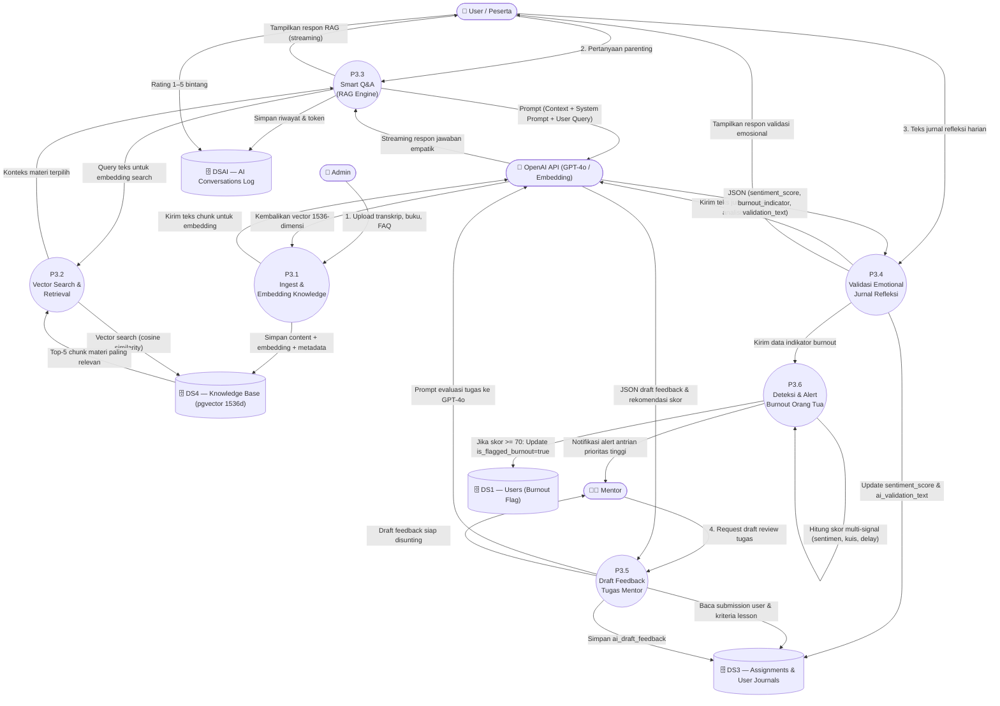

# 📑 Dokumentasi Modul DFD Level 2 — P3: AI & Knowledge Base (RAG System)
> **Platform Edukasi Parenting Bu Elly Risman · Yayasan Kita dan Buah Hati**

---

## 📌 1. Ringkasan Modul P3

Proses **P3: AI & Knowledge Base (RAG System)** adalah modul kecerdasan buatan berbasis *Retrieval-Augmented Generation* (RAG) yang dirancang untuk menskalakan kepakaran, filosofi, dan gaya komunikasi empatik **Bu Elly Risman**. 

Modul ini bertindak sebagai asisten pintar 24/7 bagi peserta, penganalisis emosi pada jurnal refleksi, pembuat draf umpan balik tugas untuk mentor, serta mesin deteksi dini tingkat stres/burnout orang tua.

---

## 🎭 2. Entitas Eksternal & Data Store Terkait

### 2.1 Entitas Eksternal
- 👤 **User / Peserta**: Mengajukan pertanyaan parenting, menerima jawaban RAG streaming, mengisi jurnal refleksi, dan memberi rating jawaban (1–5 bintang).
- 🧑‍🏫 **Mentor**: Menerima antrian tugas ber-flag burnout dan memanfaatkan *draft AI feedback* untuk efisiensi peninjauan tugas.
- 🔧 **Admin**: Mengunggah materi pengetahuan (buku, transkrip ceramah, modul, FAQ) ke dalam basis pengetahuan.
- 🤖 **OpenAI API (GPT-4o & text-embedding-3-small)**: Layanan eksternal untuk generasi embedding vektor, pemrosesan teks empatik, analisis sentimen, dan pembuatan draf JSON.

### 2.2 Data Store (Penyimpanan Data)
- **DS4 (Knowledge Base / Vector Store)**: Tabel `knowledge_base` menggunakan ekstensi `pgvector` PostgreSQL (vektor 1536 dimensi).
- **DSAI (AI Conversations & Logs)**: Tabel `ai_conversations` untuk menyimpan riwayat Q&A, token, prompt, dan rating user.
- **DS3 (Progress, Tasks & Journals)**: Tabel `user_journals` dan `assignments` yang dianalisis atau diperkaya oleh modul AI.
- **DS1 (Users)**: Tabel `users` untuk flagging indikator burnout (`is_flagged_burnout`).

---

## 📐 3. Diagram DFD Level 2 — P3 (AI & RAG System)



---

## 🔍 4. Detail Sub-Proses DFD Level 2

### 4.1 Sub-Proses P3.1: Ingestion & Vector Embedding Knowledge Base
- **Deskripsi**: Memproses bahan mentah edukasi (buku Bu Elly, transkrip rekaman seminar, artikel, FAQ) menjadi potongan teks (*chunks*) berukuran 500–1.000 karakter, kemudian mengubahnya menjadi vektor embedding.
- **Input Data**: Berkas dokumen (`.txt`, `.pdf`, `.docx`), metadata sumber (*source_type*, *title*, *chapter*).
- **Proses**:
  1. *Text Chunking* dengan *overlap* 100 karakter.
  2. Mengirim chunk teks ke API OpenAI (`text-embedding-3-small`).
  3. Menyimpan hasil vektor 1536-dimensi dan metadata ke data store `DS4 (KNOWLEDGE_BASE)`.
- **Output Data**: Data pengetahuan terekstraksi berformat vektor siap query.

### 4.2 Sub-Proses P3.2: Vector Search & Retrieval (Cosine Similarity)
- **Deskripsi**: Pencarian cepat berbasis makna (*semantic search*) menggunakan operator jarak kosinus (`<=>` di pgvector) untuk menemukan informasi yang paling relevan dengan pertanyaan user.
- **Input Data**: Vektor query pertanyaan pengguna.
- **Proses**:
  1. Mengubah pertanyaan pengguna menjadi vektor query via OpenAI.
  2. Mengeksekusi query kosinus similarity di `DS4`:
     ```sql
     SELECT title, content, 1 - (embedding <=> query_vector) AS similarity
     FROM knowledge_base
     WHERE 1 - (embedding <=> query_vector) > 0.75
     ORDER BY similarity DESC LIMIT 5;
     ```
- **Output Data**: 5 potongan (*chunks*) materi Bu Elly Risman dengan tingkat kemiripan paling tinggi.

### 4.3 Sub-Proses P3.3: Smart Q&A Empatik (RAG Engine)
- **Deskripsi**: Menyusun prompt komprehensif (konteks materi + *guardrails* + profil user) lalu menghasilkan jawaban streaming bergaya bahasa Bu Elly.
- **Input Data**: Pertanyaan user, konteks hasil P3.2, riwayat obrolan terakhir.
- **Proses**:
  1. Memvalidasi batasan (*guardrails*): Tidak memberikan diagnosis medis/psikiatri.
  2. Mengirim prompt lengkap ke model `gpt-4o` dengan parameter `temperature = 0.7`.
  3. Mengirimkan jawaban secara *real-time streaming* ke UI antarmuka user.
  4. Mencatat penggunaan token dan teks percakapan ke `DSAI (AI_CONVERSATIONS)`.
- **Output Data**: Respon jawaban RAG empatik & pencatatan log percakapan.

### 4.4 Sub-Proses P3.4: Validasi Emosional Jurnal Refleksi
- **Deskripsi**: Menganalisis kondisi psikologis dan perasaan orang tua yang dituangkan dalam jurnal refleksi harian pasca-praktik.
- **Input Data**: `journal_text`, `user_id`, `lesson_id`.
- **Proses**:
  1. Mengirim teks jurnal ke GPT-4o untuk analisis kualitatif.
  2. Menghasilkan skor sentimen (`sentiment_score` 0.0 - 1.0) dan indikator burnout (`burnout_indicator` 0 - 100).
  3. Menggenerasi pesan tanggapan validasi emosional (maksimal 150 kata) yang menenangkan dan menguatkan.
  4. Menyimpan hasil analisis ke `DS3 (USER_JOURNALS)`.
- **Output Data**: Pesan validasi emosional di antarmuka pengguna & metrik sentimen.

### 4.5 Sub-Proses P3.5: Draft Feedback Tugas (Mentor AI Assist)
- **Deskripsi**: Membantu Mentor dalam mengevaluasi tugas praktik peserta dengan membuatkan draf saran perbaikan dan usulan nilai secara otomatis.
- **Input Data**: `submission_text` / deskripsi media, modul & `lesson_id`.
- **Proses**:
  1. Menggabungkan petunjuk tugas lesson dengan kiriman peserta.
  2. GPT-4o menghasilkan JSON terstruktur berisi:
     - `praise_points`: Apresiasi atas hal yang sudah tepat.
     - `improvement_areas`: Saran perbaikan praktik pengasuhan.
     - `suggested_score`: Usulan nilai (skala 1–100).
  3. Menyimpan draf ke kolom `ai_draft_feedback` pada `DS3 (ASSIGNMENTS)`.
- **Output Data**: Draf teks umpan balik di Panel Filament Mentor.

### 4.6 Sub-Proses P3.6: Deteksi Multi-Signal & Alert Burnout
- **Deskripsi**: Mengagregasi beberapa sinyal risiko stres berlebih pada peserta dan memberikan peringatan dini kepada tim Mentor.
- **Input Data**: `burnout_indicator` (jurnal), kata kunci spesifik (misal: "frustrasi", "menyerah", "ingin pukul"), keterlambatan pengumpulan tugas (>7 hari), dan kegagalan kuis berulang.
- **Proses**:
  1. Menghitung *Combined Burnout Score*:
     $$\text{Burnout Score} = (0.5 \times \text{Journal Burnout}) + (0.2 \times \text{Keyword Weight}) + (0.3 \times \text{Delay Score})$$
  2. Jika skor agregat $\ge 70$:
     - Mengubah status `users.is_flagged_burnout = true` di `DS1`.
     - Mengirimkan alert prioritas tinggi ke Dashboard Mentor Filament.
     - Memicu pengiriman email empatik otomatis dari sistem.
- **Output Data**: Status flag burnout user & notifikasi antrian darurat mentor.

---

## 📊 5. Matriks Aliran Data (Data Flow Matrix)

| Ref | Nama Data Flow | Entitas Asal | Sub-Proses | Target Storage | Entitas Tujuan |
| :--- | :--- | :--- | :--- | :--- | :--- |
| **DF1** | Teks Dokumen & Transkrip | Admin | P3.1 (Ingest) | `DS4 (knowledge_base)` | OpenAI API |
| **DF2** | Query Teks Pertanyaan | User | P3.2 (Vector Search) | `DS4 (knowledge_base)` | P3.3 (RAG Engine) |
| **DF3** | Relevant Chunks + System Prompt | P3.2 | P3.3 (RAG Engine) | `DSAI (ai_conversations)` | OpenAI API |
| **DF4** | Jawaban Streaming & Rating | OpenAI API | P3.3 (RAG Engine) | `DSAI (ai_conversations)` | User |
| **DF5** | Teks Jurnal Refleksi | User | P3.4 (Validasi Jurnal)| `DS3 (user_journals)` | OpenAI API |
| **DF6** | Sentimen & Teks Validasi | OpenAI API | P3.4 (Validasi Jurnal)| `DS3 (user_journals)` | User & P3.6 |
| **DF7** | Submission Tugas | DS3 | P3.5 (Draft Feedback) | `DS3 (assignments)` | Mentor |
| **DF8** | Multi-Signal Burnout Alert | P3.6 | P3.6 (Deteksi Burnout)| `DS1 (users)` | Mentor Dashboard |

---

## 🗄️ 6. Skema Data Store Terkait

```text
DS4: Knowledge Base (pgvector)
 └── KNOWLEDGE_BASE (id, source_type, title, content, embedding [vector(1536)], metadata)

DSAI: AI Conversations Log
 └── AI_CONVERSATIONS (id, user_id, lesson_id, user_message, ai_response, prompt_used, model_used, tokens_used, user_rating)

DS3: Progress, Assignments & Journals
 ├── USER_JOURNALS (id, user_id, journal_text, sentiment_score, burnout_indicator, ai_validation_text)
 └── ASSIGNMENTS (id, user_id, submission_text, ai_draft_feedback, mentor_feedback, score)
```

---

## 🛡️ 7. Guardrails & System Prompting (Gaya Bu Elly Risman)

### 7.1 Karakteristik Tone & Respon AI
1. **Bahasa Empatik & Hangat**: Menggunakan sapaan ramah seperti *"Bunda"*, *"Ayah"*, atau *"Sahabat Bu Elly"*.
2. **Berbasis Nilai & Agama**: Menyelipkan sudut pandang pengasuhan psikologi perkembangan yang sejalan dengan nilai-nilai moral/Islam tanpa memicu perdebatan doktrin.
3. **Konstruktif & Tanpa Menghakimi**: Menghindari nada menyalahkan orang tua atas kesalahan masa lalu.

### 7.2 Strict Medical Guardrail
```text
SYSTEM PROMPT SAFETY:
Jika pengguna mengindikasikan gejala klinis berat (seperti kecenderungan melukai diri sendiri, 
depresi berat, atau kekerasan fisik anak yang membahayakan nyawa), AI WAJIB menyajikan 
tanggapan pertolongan pertama emosional dan merekomendasikan rujukan langsung ke 
Psikolog Klinis / Layanan Konseling Yayasan Kita dan Buah Hati.
```

---

## 🛠️ 8. Skenario Penanganan Error & Edge Cases

| Skenario Error | Penyebab | Penanganan Sistem |
| :--- | :--- | :--- |
| **Low Similarity Score (< 0.65)** | Pertanyaan di luar topik parenting atau di luar materi Bu Elly | AI memberikan respon sopan bahwa topik tidak ditemukan dalam materi, lalu menawarkan untuk meneruskan pertanyaan ke Mentor Manusia. |
| **OpenAI API Rate Limit / Timeout** | Gangguan koneksi atau batas kuota API eksternal | Terapkan *exponential backoff retry* (maks 3x retry). Jika tetap gagal, tampilkan pesan ramah dan simpan pertanyaan ke dalam antrian *offline job*. |
| **False Positive Burnout Flag** | Pengguna menggunakan kata-kata hiperbola (misal: "mau pingsan rasanya") | Mentor melakukan verifikasi manual (*human-in-the-loop*) sebelum mengambil tindakan rujukan lanjutan. |
