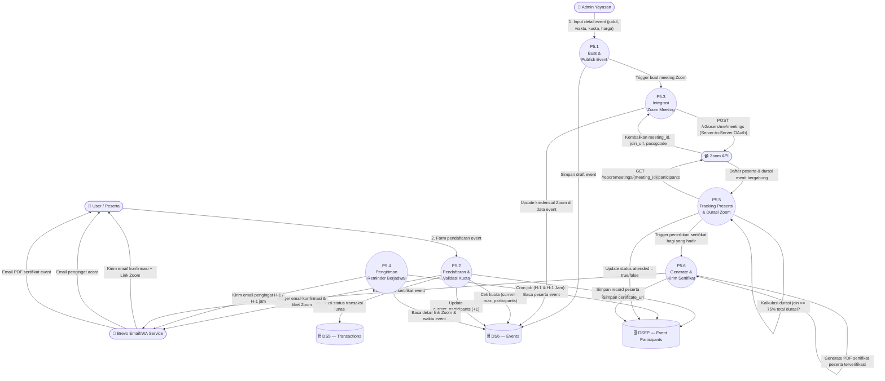

# 📑 Dokumentasi Modul DFD Level 2 — P5: Manajemen Event
> **Platform Edukasi Parenting Bu Elly Risman · Yayasan Kita dan Buah Hati**

---

## 📌 1. Ringkasan Modul P5

Proses **P5: Manajemen Event** bertanggung jawab atas seluruh siklus hidup penyelenggaraan acara edukasi parenting *live/hybrid*, seperti Webinar, Workshop, dan Bootcamp. 

Modul ini memfasilitasi pembuatan acara oleh Admin, pendaftaran dan kuota peserta, integrasi otomatis dengan **Zoom Meeting API**, pengiriman pengingat berjadwal, pelacakan tingkat kehadiran peserta secara akurat, hingga penerbitan sertifikat digital bagi peserta yang memenuhi kriteria presensi minimum.

---

## 🎭 2. Entitas Eksternal & Data Store Terkait

### 2.1 Entitas Eksternal
- 👤 **User / Peserta**: Memilih event, mendaftar/membeli tiket, menerima link Zoom unik, mengikuti acara, dan mengunduh sertifikat event.
- 🔧 **Admin (Yayasan)**: Mengatur jadwal acara, menentukan jenis/format event, menetapkan kapasitas kuota, serta memantau rekaman dan presensi.
- 📹 **Zoom API**: Layanan konferensi video eksternal untuk membuat ruang pertemuan (*meeting/webinar*), menghasilkan URL peserta, dan menyediakan laporan durasi kehadiran (*attendance report*).
- 📧 **Brevo (Email & WA Service)**: Layanan notifikasi untuk mengirimkan konfirmasi pendaftaran, link acara, pengingat H-1 / H-1 jam, dan berkas sertifikat.

### 2.2 Data Store (Penyimpanan Data)
- **DS6 (Events)**: Tabel `events` yang menyimpan informasi utama acara (judul, deskripsi, waktu, harga, kuota, kredensial Zoom).
- **DSEP (Event Participants)**: Tabel `event_participants` yang mencatat relasi pendaftaran peserta, status presensi, dan URL sertifikat.
- **DS5 (Transactions)**: Tabel `transactions` yang memverifikasi status kelunasan tiket berbayar sebelum pendaftaran diaktifkan.

---

## 📐 3. Diagram DFD Level 2 — P5 (Manajemen Event)



---

## 🔍 4. Detail Sub-Proses DFD Level 2

### 4.1 Sub-Proses P5.1: Buat & Publish Event
- **Deskripsi**: Mengakomodasi pembuatan dan publikasi acara baru (Webinar, Workshop, atau Bootcamp) oleh Admin.
- **Input Data**: `title`, `slug`, `description`, `type` (webinar/workshop/bootcamp), `format` (online/offline/hybrid), `start_datetime`, `end_datetime`, `max_participants`, `price`.
- **Proses**:
  1. Validasi tanggal acara (`start_datetime > NOW()`).
  2. Menyimpan entri baru ke `DS6 (EVENTS)` dengan status `is_published = true`.
  3. Memanggil fungsi otomasi P5.3 jika format acara menyertakan sesi online Zoom.
- **Output Data**: Entri event terpublikasi di katalog acara frontend.

### 4.2 Sub-Proses P5.2: Pendaftaran & Validasi Kuota
- **Deskripsi**: Memproses reservasi tempat bagi pengguna, baik event gratis maupun event berbayar (pasca-pembayaran di modul P4).
- **Input Data**: `event_id`, `user_id`, `transaction_id`.
- **Proses**:
  1. Mengecek kuota tersisa di `DS6 (EVENTS)` (`current_participants < max_participants`).
  2. Memeriksa status transaksi di `DS5 (TRANSACTIONS)` jika event berbayar (`status = 'paid'`).
  3. Menyimpan data pendaftaran ke `DSEP (EVENT_PARTICIPANTS)` dengan `attended = false`.
  4. Meningkatkan jumlah `current_participants` di `DS6`.
  5. Memicu pengiriman email bukti pendaftaran dan tautan Zoom via Brevo.
- **Output Data**: Rekam pendaftaran terkonfirmasi & email tiket.

### 4.3 Sub-Proses P5.3: Otomasi Integrasi Zoom Meeting
- **Deskripsi**: Berinteraksi langsung dengan Zoom API v2 menggunakan *Server-to-Server OAuth* untuk membuat ruang pertemuan tanpa perlu input manual admin.
- **Input Data**: `title`, `start_datetime`, `duration_minutes`.
- **Proses**:
  1. Mengirimkan request autentikasi token OAuth Zoom.
  2. Memanggil endpoint `POST https://api.zoom.us/v2/users/me/meetings` dengan payload:
     ```json
     {
       "topic": "Akademi Parenting: [Judul Event]",
       "type": 2,
       "start_time": "2026-10-15T19:00:00Z",
       "duration": 90,
       "settings": {
         "host_video": true,
         "participant_video": false,
         "join_before_host": false,
         "mute_upon_entry": true,
         "waiting_room": true
       }
     }
     ```
  3. Menyimpan `zoom_meeting_id`, `zoom_join_url`, dan `zoom_password` ke `DS6 (EVENTS)`.
- **Output Data**: Tautan ruang Zoom terintegrasi.

### 4.4 Sub-Proses P5.4: Pengiriman Reminder Berjadwal
- **Deskripsi**: Menjalankan *cron job* berjadwal di Laravel Queue Worker untuk mengingatkan peserta agar tidak melewatkan acara.
- **Input Data**: `start_datetime` dari `DS6`, daftar email peserta dari `DSEP`.
- **Proses**:
  1. *Scheduler H-1* (dijalankan 24 jam sebelum acara): Mengirimkan ringkasan materi pembekalan dan reminder tanggal.
  2. *Scheduler H-1 Jam* (dijalankan 60 menit sebelum acara): Mengirimkan pesan berisi tombol akses langsung (*Direct Join Link*).
- **Output Data**: Email & WhatsApp reminder terkirim ke peserta.

### 4.5 Sub-Proses P5.5: Tracking Presensi & Durasi Zoom
- **Deskripsi**: Memverifikasi kehadiran nyata peserta berdasarkan log durasi konferensi video Zoom setelah acara selesai.
- **Input Data**: `zoom_meeting_id`, log peserta dari Zoom Report API.
- **Proses**:
  1. Setelah event berakhir, worker memanggil endpoint: `GET https://api.zoom.us/v2/report/meetings/{meeting_id}/participants`.
  2. Mencocokkan email peserta Zoom dengan email terdaftar di `DSEP`.
  3. Akumulasi total menit bergabung peserta ($\sum \text{duration}$).
  4. Menghitung rasio kehadiran:
     - `Persentase Kehadiran` = `(Total Durasi Join Peserta / Durasi Total Event) × 100%`
  5. Jika persentase ≥ `75%`, update `DSEP (EVENT_PARTICIPANTS)` -> `attended = true` dan catat `attendance_timestamp`.
- **Output Data**: Data status presensi final terverifikasi.

### 4.6 Sub-Proses P5.6: Generate & Kirim Sertifikat Event
- **Deskripsi**: Menggenerasi dokumen sertifikat apresiasi bagi peserta yang terverifikasi hadir minimal 75% dari durasi acara.
- **Input Data**: `user_id`, `event_id`, `attended = true`.
- **Proses**:
  1. Mengambil template desain sertifikat event.
  2. Menyisipkan Nama Peserta, Judul Event, Tanggal, dan QR Code Verifikasi.
  3. Merender PDF dan mengunggah ke CDN storage.
  4. Menyimpan tautan PDF ke `DSEP (EVENT_PARTICIPANTS.certificate_url)`.
  5. Mengirimkan email ucapan terima kasih dan sertifikat via Brevo.
- **Output Data**: Berkas PDF Sertifikat Event terkirim ke email peserta.

---

## 📊 5. Matriks Aliran Data (Data Flow Matrix)

| Ref | Nama Data Flow | Entitas Asal | Sub-Proses | Target Storage | Entitas Tujuan |
| :--- | :--- | :--- | :--- | :--- | :--- |
| **DF1** | Form Pembuatan Event | Admin | P5.1 (Buat Event) | `DS6 (events)` | P5.3 (Zoom) |
| **DF2** | Zoom Meeting Credentials | Zoom API | P5.3 (Integrasi Zoom)| `DS6 (events)` | Admin & User |
| **DF3** | Data Form Pendaftaran | User | P5.2 (Pendaftaran) | `DSEP (event_participants)` | Brevo |
| **DF4** | Notifikasi Tiket & Link | Brevo | P5.2 (Pendaftaran) | - | User |
| **DF5** | Email Pengingat H-1 / H-1 Jam | P5.4 (Scheduler)| P5.4 (Reminder) | - | User |
| **DF6** | Participant Attendance Report | Zoom API | P5.5 (Presensi Zoom) | `DSEP (event_participants)` | P5.6 (Sertifikat) |
| **DF7** | PDF Sertifikat Event | P5.6 | P5.6 (Sertifikat) | `DSEP (certificate_url)` | User |

---

## 🗄️ 6. Skema Data Store Terkait

```text
DS6: Events
 └── EVENTS (id, title, slug, type, format, start_datetime, end_datetime, zoom_meeting_id, zoom_join_url, zoom_password, max_participants, current_participants, price, is_published)

DSEP: Event Participants
 └── EVENT_PARTICIPANTS (id, event_id, user_id, transaction_id, attended, attendance_timestamp, certificate_url)

DS5: Transactions
 └── TRANSACTIONS (id, user_id, event_id, amount, status, paid_at)
```

---

## ⚙️ 7. Aturan Bisnis & Algoritma Utama

1. **Aturan Validasi Kuota (Overbooking Prevention)**:
   - Penguncian baris (*pessimistic locking*) diterapkan saat transaksi event berbayar atau pendaftaran event gratis dilakukan:
     - `Sisa Kuota` = `max_participants` - `current_participants`
   - Jika `Sisa Kuota` ≤ `0`, tombol pendaftaran otomatis dinonaktifkan (*Sold Out*).

2. **Kriteria Kelulusan Sertifikat Presensi**:
   - `Attended Status` = `true` jika `(Menit Join Peserta / Durasi Total Event) ≥ 75%`, selain itu `false`.

3. **Retensi & Akses Rekaman (Recording Access)**:
   - Tautan rekaman event (`recording_url`) diunggah ke Bunny.net Stream 24 jam pasca-event dan secara otomatis terbuka untuk semua peserta yang terdaftar di `DSEP`.

---

## 🛠️ 8. Skenario Penanganan Error & Edge Cases

| Skenario Error | Penyebab | Penanganan Sistem |
| :--- | :--- | :--- |
| **Zoom API Downtime / Token Expired** | Kegagalan saat `P5.3` (Gagal membuat meeting) | Sistem menandai event sebagai `zoom_pending`, lalu worker melakukan *retry job* secara otomatis. Admin diberi opsi manual input Zoom URL. |
| **Email Peserta Zoom Berbeda dengan Akun** | Peserta bergabung di Zoom menggunakan akun/email pribadi yang berbeda dengan email terdaftar | Tampilkan pesan petunjuk sebelum join Zoom agar memasukkan email terdaftar. Sediakan fitur *claim presensi manual* via foto tangkapan layar jika email tak cocok. |
| **Pembatalan / Refund Tiket Event** | User mengajukan pembatalan sebelum H-3 event | Update status transaksi di `DS5` -> `refunded`, kurangi `current_participants` di `DS6`, dan hapus record dari `DSEP`. |
