# 📋 PRD — Akademi Parenting Kita & Buah Hati
### Platform Edukasi Parenting Bu Elly Risman · Yayasan Kita dan Buah Hati

---

> **Dokumen:** Product Requirements Document (PRD) + Database Diagram + Diagram Alir  
> **Versi:** 2.0  
> **Tanggal:** 29 September 2026  
> **Status:** Draft — Siap Review Tim  
> **Penulis:** Tim Produk  

---

## 📑 DAFTAR ISI

1. [Ringkasan Eksekutif](#1-ringkasan-eksekutif)  
2. [Tujuan & Scope Produk](#2-tujuan--scope-produk)  
3. [Persona Pengguna](#3-persona-pengguna)  
4. [Arsitektur Sistem](#4-arsitektur-sistem)  
5. [Entity Relationship Diagram (ERD)](#5-entity-relationship-diagram-erd)  
6. [Data Flow Diagram (DFD)](#6-data-flow-diagram-dfd)  
7. [Diagram Alir — User Journey](#7-diagram-alir--user-journey)  
8. [Diagram Alir — Proses Bisnis Utama](#8-diagram-alir--proses-bisnis-utama)  
9. [Spesifikasi Fitur Detail](#9-spesifikasi-fitur-detail)  
10. [Non-Functional Requirements](#10-non-functional-requirements)  
11. [Acceptance Criteria](#11-acceptance-criteria)  
12. [Roadmap Implementasi](#12-roadmap-implementasi)  
13. [KPI & Metrik Keberhasilan](#13-kpi--metrik-keberhasilan)  
14. [Risiko & Mitigasi](#14-risiko--mitigasi)  

---

## 1. Ringkasan Eksekutif

### 1.1 Latar Belakang

**Elly Risman Musa** (lahir Aceh, 21 April 1951) adalah psikolog Indonesia spesialis pengasuhan anak dan Direktur Pelaksana Yayasan Kita dan Buah Hati. Dengan pengalaman puluhan tahun, Bu Elly telah menjangkau jutaan orang tua melalui seminar, buku, dan media. Namun, jangkauan ini masih terbatas oleh faktor geografis, waktu, dan kapasitas.

**Platform Akademi Parenting** hadir untuk mendigitalkan dan menskalakan edukasi parenting Bu Elly, menjadikannya:
- **Accessible**: Bisa diakses kapan saja, di mana saja
- **Terstruktur**: Kurikulum berjenjang dengan asesmen di setiap tahap
- **Empatik**: Didukung AI yang bicara dengan filosofi Bu Elly
- **Terukur**: KPI yang jelas untuk setiap tahap pembelajaran

### 1.2 Visi Produk

> *"Menjadikan edukasi parenting berkualitas, terstruktur, dan menjangkau semua lapisan masyarakat melalui pendekatan hybrid (online & offline) yang empatik dan terukur."*

### 1.3 Proposisi Nilai Utama

| Diferensiasi | Deskripsi |
|---|---|
| **Metode 2-Layer Video** | Video Besar (materi) + Video Kecil (validasi perasaan) |
| **AI Empatik** | AI yang bicara dengan filosofi & terminologi khas Bu Elly |
| **Hybrid Learning** | Integrasi pengalaman offline ke dalam ekosistem online |
| **Reverse Funnel** | Konversi dari buku fisik (6.000 eks.) ke platform digital |
| **Burnout Detection** | Sistem deteksi dini burnout orang tua secara proaktif |

---

## 2. Tujuan & Scope Produk

### 2.1 Tujuan Bisnis

- Mendistribusikan **6.000 buku fisik** sebagai funnel ke platform digital
- Mencapai **10.000 pengguna terdaftar** dalam 12 bulan
- Menghasilkan revenue **≥ Rp 800 juta** dalam 12 bulan pertama
- **Completion rate e-course ≥ 60%** (benchmark industri: ~40%)

### 2.2 In-Scope (MVP)

- ✅ Modul E-Course dengan metode 2-Layer Video
- ✅ Sistem Asesmen (Pre-test, Kuis, Post-test, Tugas Praktik)
- ✅ Jurnal Refleksi + AI Validasi Empatik
- ✅ Smart Q&A berbasis RAG (AI Bu Elly)
- ✅ Modul Event (Webinar, Workshop, Bootcamp)
- ✅ Dashboard Mentor (Filament PHP)
- ✅ Payment Gateway (QRIS Dinamas via Xendit)
- ✅ Sistem Aktivasi Kode Buku
- ✅ Sertifikat Digital Otomatis
- ✅ Burnout Detection & Alert System

### 2.3 Out-of-Scope (Future Releases)

- ❌ Aplikasi Mobile Native (iOS/Android) — v2.0
- ❌ Marketplace buku dari penulis lain — v3.0
- ❌ Live streaming kelas real-time — v2.0
- ❌ Blockchain verification sertifikat — v2.0
- ❌ Program affiliate untuk guru/komunitas — v1.5

---

## 3. Persona Pengguna

### Persona 1 — "Bunda Muda" (Primary)

```
Nama: Anisa (32 tahun)
Profesi: Ibu Rumah Tangga
Anak: 2 anak (usia 3 & 6 tahun)
Tantangan: Anak sering tantrum, tidak tahu cara merespons dengan benar
Tech Savvy: Medium (aktif Instagram, WhatsApp)
Motivasi: Ingin jadi ibu yang lebih baik, belajar dari pakar terpercaya
Hambatan: Sibuk, tidak punya waktu ikut seminar offline
Sumber: Beli buku Bu Elly di Gramedia → scan QR Code
```

### Persona 2 — "Ayah Profesional" (Secondary)

```
Nama: Reza (38 tahun)
Profesi: Karyawan Swasta
Anak: 1 anak (usia 8 tahun)
Tantangan: Anak kecanduan gadget, konflik sering terjadi
Tech Savvy: High
Motivasi: Ingin belajar ilmu parenting berbasis sains
Hambatan: Waktu terbatas, lebih suka belajar mandiri (self-paced)
Sumber: Google search → landing page
```

### Persona 3 — "Mentor" (Internal)

```
Nama: Siti (40 tahun)
Profesi: Psikolog / Konselor Parenting bersertifikat
Tanggung jawab: Review tugas praktik, jawab Q&A, deteksi burnout user
Tool utama: Dashboard Filament PHP
Kebutuhan: Efisiensi (bantu AI), notifikasi real-time, prioritas antrian
```

### Persona 4 — "Admin" (Internal)

```
Nama: Dian (28 tahun)
Profesi: Staff IT / Digital Marketing Yayasan
Tanggung jawab: Manajemen konten, laporan distribusi buku, monitoring KPI
Tool utama: Admin Panel Filament + Analytics Dashboard
```

---

## 4. Arsitektur Sistem

### 4.1 Stack Teknologi

```
┌──────────────────────────────────────────────────────────┐
│             FRONTEND LAYER                               │
│   Livewire 3 + Alpine.js + Tailwind CSS                  │
│   Blade Templates + Filament PHP (Admin/Mentor)          │
├──────────────────────────────────────────────────────────┤
│             APPLICATION LAYER                            │
│   Laravel 11 + Spatie Permission + Laravel Sanctum       │
│   Queue Workers (Redis) + Scheduled Jobs                 │
├──────────────────────────────────────────────────────────┤
│             SERVICES LAYER                               │
│   OpenAI GPT-4o (AI/RAG)  │  Xendit (Payment)           │
│   Brevo (Email)            │  Zoom API (Event)           │
│   Bunny.net Stream (Video) │  Sentry (Error Tracking)    │
├──────────────────────────────────────────────────────────┤
│             DATA LAYER                                   │
│   PostgreSQL 15 + pgvector │  Redis (Cache/Session)      │
│   Bunny.net Storage (CDN)  │  Local Storage (Uploads)    │
└──────────────────────────────────────────────────────────┘
```

### 4.2 Infrastruktur & DevOps

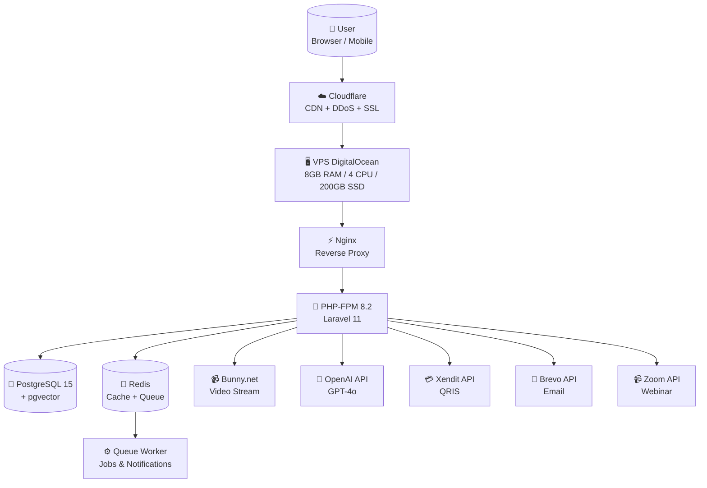
```mermaid
graph TD
    USER[("👤 User<br/>Browser / Mobile")] --> CF["☁️ Cloudflare<br/>CDN + DDoS + SSL"]
    CF --> VPS["🖥️ VPS DigitalOcean<br/>8GB RAM / 4 CPU / 200GB SSD"]
    VPS --> NGINX["⚡ Nginx<br/>Reverse Proxy"]
    NGINX --> PHP["🐘 PHP-FPM 8.2<br/>Laravel 11"]
    PHP --> PG[("🐘 PostgreSQL 15<br/>+ pgvector")]
    PHP --> REDIS[("🔴 Redis<br/>Cache + Queue")]
    PHP --> BUNNY["📹 Bunny.net<br/>Video Stream"]
    PHP --> OPENAI["🤖 OpenAI API<br/>GPT-4o"]
    PHP --> XENDIT["💳 Xendit API<br/>QRIS"]
    PHP --> BREVO["📧 Brevo API<br/>Email"]
    PHP --> ZOOM["📹 Zoom API<br/>Webinar"]
    REDIS --> WORKER["⚙️ Queue Worker<br/>Jobs & Notifications"]
```

---

## 5. Entity Relationship Diagram (ERD)

### 5.1 ERD Lengkap


```mermaid
erDiagram
    USERS {
        bigint id PK
        varchar name
        varchar email
        varchar password
        varchar phone
        bigint role_id FK
        enum parenting_style
        integer child_count
        json child_ages
        varchar avatar
        boolean is_active
        boolean is_flagged_burnout
        timestamp email_verified_at
        timestamp created_at
    }

    ROLES {
        bigint id PK
        varchar name
        json permissions
    }

    COURSES {
        bigint id PK
        varchar title
        varchar slug
        text description
        varchar thumbnail
        decimal price
        integer duration_hours
        enum level
        boolean is_offline_hybrid
        varchar offline_location
        json offline_dates
        integer max_offline_participants
        boolean is_published
        bigint created_by FK
        timestamp published_at
    }

    MODULES {
        bigint id PK
        bigint course_id FK
        varchar title
        text description
        integer order_index
        boolean is_published
    }

    LESSONS {
        bigint id PK
        bigint module_id FK
        varchar title
        enum type
        integer order_index
        varchar video_large_url
        integer video_large_duration
        varchar video_small_url
        integer video_small_duration
        text content_text
        boolean allow_skip
        integer min_watch_percentage
        boolean is_published
    }

    LESSON_QUIZZES {
        bigint id PK
        bigint lesson_id FK
        text question
        json options
        char correct_answer
        text explanation
        integer order_index
    }

    USER_ENROLLMENTS {
        bigint id PK
        bigint user_id FK
        bigint course_id FK
        timestamp enrolled_at
        timestamp completed_at
        decimal progress_percentage
        decimal pre_test_score
        decimal post_test_score
        varchar certificate_url
        timestamp certificate_issued_at
    }

    USER_PROGRESS {
        bigint id PK
        bigint user_id FK
        bigint lesson_id FK
        enum status
        integer video_watched_percentage
        decimal quiz_score
        integer quiz_attempts
        integer last_position_seconds
        timestamp completed_at
    }

    ASSIGNMENTS {
        bigint id PK
        bigint user_id FK
        bigint lesson_id FK
        text submission_text
        varchar submission_file
        varchar submission_video_url
        timestamp submitted_at
        bigint mentor_id FK
        text mentor_feedback
        text ai_draft_feedback
        decimal score
        enum status
        timestamp reviewed_at
    }

    USER_JOURNALS {
        bigint id PK
        bigint user_id FK
        bigint lesson_id FK
        text journal_text
        decimal sentiment_score
        decimal burnout_indicator
        text ai_validation_text
        timestamp created_at
    }

    KNOWLEDGE_BASE {
        bigint id PK
        enum source_type
        varchar source_id
        varchar title
        text content
        vector embedding
        json metadata
        timestamp created_at
    }

    AI_CONVERSATIONS {
        bigint id PK
        bigint user_id FK
        bigint lesson_id FK
        enum context_type
        text user_message
        text ai_response
        text prompt_used
        varchar model_used
        integer tokens_used
        json relevance_sources
        integer user_rating
        timestamp created_at
    }

    TRANSACTIONS {
        bigint id PK
        bigint user_id FK
        bigint course_id FK
        bigint event_id FK
        bigint book_id FK
        decimal amount
        enum payment_method
        varchar payment_gateway
        varchar transaction_id
        enum status
        timestamp paid_at
        varchar qris_url
        timestamp expires_at
    }

    EVENTS {
        bigint id PK
        varchar title
        varchar slug
        text description
        enum type
        enum format
        timestamp start_datetime
        timestamp end_datetime
        varchar zoom_meeting_id
        varchar zoom_join_url
        varchar zoom_password
        varchar offline_location
        integer max_participants
        integer current_participants
        decimal price
        varchar thumbnail
        varchar recording_url
        boolean is_published
    }

    EVENT_PARTICIPANTS {
        bigint id PK
        bigint event_id FK
        bigint user_id FK
        bigint transaction_id FK
        boolean attended
        timestamp attendance_timestamp
        varchar certificate_url
    }

    BOOKS {
        bigint id PK
        varchar title
        varchar isbn
        varchar author
        decimal price
        integer stock
        varchar qr_code_prefix
        integer total_distributed
        integer target_distribution
    }

    BOOK_ACTIVATIONS {
        bigint id PK
        bigint book_id FK
        varchar activation_code
        bigint user_id FK
        timestamp activated_at
        json bonus_content_unlocked
        enum distribution_channel
    }

    BOOK_DISTRIBUTIONS {
        bigint id PK
        bigint book_id FK
        enum channel
        integer quantity
        date distribution_date
        text notes
    }

    USERS ||--o{ USER_ENROLLMENTS : "enrolls in"
    USERS ||--o{ USER_PROGRESS : "tracks"
    USERS ||--o{ ASSIGNMENTS : "submits"
    USERS ||--o{ USER_JOURNALS : "writes"
    USERS ||--o{ AI_CONVERSATIONS : "has"
    USERS ||--o{ TRANSACTIONS : "makes"
    USERS ||--o{ EVENT_PARTICIPANTS : "participates"
    USERS }o--|| ROLES : "has role"
    USERS ||--o{ BOOK_ACTIVATIONS : "activates"

    COURSES ||--o{ MODULES : "contains"
    COURSES ||--o{ USER_ENROLLMENTS : "enrolled by"
    COURSES ||--o{ TRANSACTIONS : "purchased via"

    MODULES ||--o{ LESSONS : "has"

    LESSONS ||--o{ LESSON_QUIZZES : "has"
    LESSONS ||--o{ USER_PROGRESS : "tracked in"
    LESSONS ||--o{ ASSIGNMENTS : "has"
    LESSONS ||--o{ USER_JOURNALS : "linked to"
    LESSONS ||--o{ AI_CONVERSATIONS : "contextualized in"

    EVENTS ||--o{ EVENT_PARTICIPANTS : "has"
    EVENTS ||--o{ TRANSACTIONS : "purchased via"

    BOOKS ||--o{ BOOK_ACTIVATIONS : "generates"
    BOOKS ||--o{ BOOK_DISTRIBUTIONS : "tracked in"
    BOOKS ||--o{ TRANSACTIONS : "purchased via"
```

### 5.2 Diagram Relasi Antar Domain

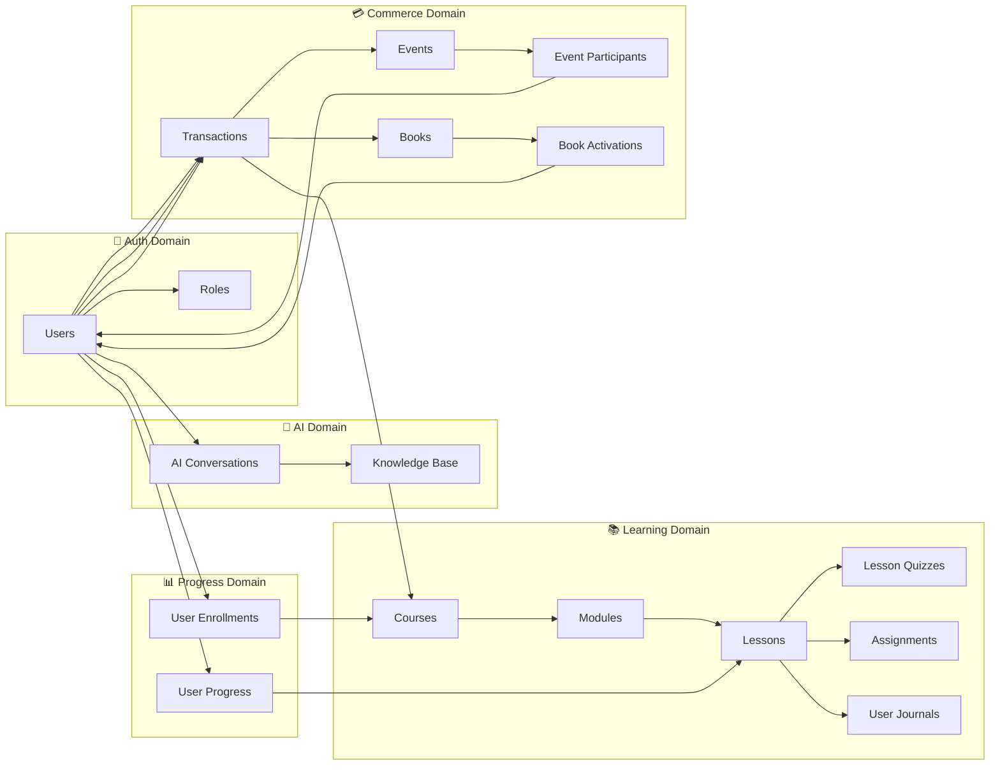
```mermaid
graph LR
    subgraph "🔐 Auth Domain"
        U[Users] --> R[Roles]
    end

    subgraph "📚 Learning Domain"
        C[Courses] --> M[Modules]
        M --> L[Lessons]
        L --> LQ[Lesson Quizzes]
        L --> A[Assignments]
        L --> J[User Journals]
    end

    subgraph "📊 Progress Domain"
        UE[User Enrollments]
        UP[User Progress]
    end

    subgraph "🤖 AI Domain"
        KB[Knowledge Base]
        AIC[AI Conversations]
    end

    subgraph "💳 Commerce Domain"
        T[Transactions]
        E[Events]
        EP[Event Participants]
        B[Books]
        BA[Book Activations]
    end

    U --> UE --> C
    U --> UP --> L
    U --> AIC --> KB
    U --> T --> C
    U --> T --> E
    U --> T --> B
    E --> EP --> U
    B --> BA --> U
```

---

## 6. Data Flow Diagram (DFD)

> **Konvensi DFD:**
> - 🟦 **Persegi panjang** = Entitas Eksternal (aktor di luar sistem)
> - ⭕ **Lingkaran/Rounded** = Proses (transformasi data)
> - 🗄️ **Persegi garis terbuka** = Data Store (penyimpanan data)
> - **Panah** = Aliran data (data flow) beserta nama data yang mengalir

---

### 6.1 DFD Level 0 — Context Diagram (Gambaran Sistem Keseluruhan)

Context diagram menunjukkan sistem sebagai satu proses tunggal dengan semua entitas eksternal yang berinteraksi.

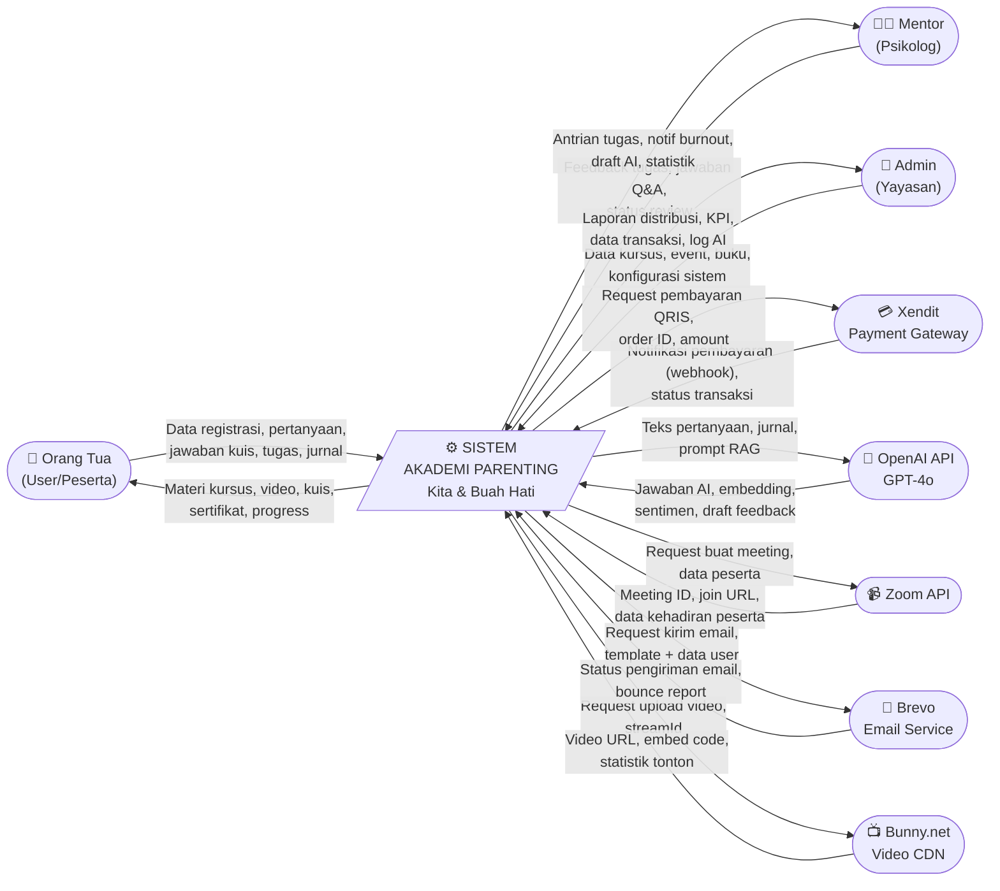
```mermaid
flowchart LR
    %% Entitas Eksternal
    USER(["👤 Orang Tua\n(User/Peserta)"])
    MENTOR(["🧑‍🏫 Mentor\n(Psikolog)"])
    ADMIN(["🔧 Admin\n(Yayasan)"])
    XENDIT(["💳 Xendit\nPayment Gateway"])
    OPENAI(["🤖 OpenAI API\nGPT-4o"])
    ZOOM(["📹 Zoom API"])
    BREVO(["📧 Brevo\nEmail Service"])
    BUNNY(["📺 Bunny.net\nVideo CDN"])

    %% Sistem Utama
    SYS[/"⚙️ SISTEM\nAKADEMI PARENTING\nKita & Buah Hati"/]

    %% Aliran Data IN
    USER -- "Data registrasi, pertanyaan,\njawaban kuis, tugas, jurnal" --> SYS
    MENTOR -- "Feedback tugas, jawaban Q&A,\nstatus review" --> SYS
    ADMIN -- "Data kursus, event, buku,\nkonfigurasi sistem" --> SYS
    XENDIT -- "Notifikasi pembayaran (webhook),\nstatus transaksi" --> SYS
    OPENAI -- "Jawaban AI, embedding,\nsentimen, draft feedback" --> SYS
    ZOOM -- "Meeting ID, join URL,\ndata kehadiran peserta" --> SYS

    %% Aliran Data OUT
    SYS -- "Materi kursus, video, kuis,\nsertifikat, progress" --> USER
    SYS -- "Antrian tugas, notif burnout,\ndraft AI, statistik" --> MENTOR
    SYS -- "Laporan distribusi, KPI,\ndata transaksi, log AI" --> ADMIN
    SYS -- "Request pembayaran QRIS,\norder ID, amount" --> XENDIT
    SYS -- "Teks pertanyaan, jurnal,\nprompt RAG" --> OPENAI
    SYS -- "Request buat meeting,\ndata peserta" --> ZOOM
    SYS -- "Request kirim email,\ntemplate + data user" --> BREVO
    SYS -- "Request upload video,\nstreamId" --> BUNNY
    BUNNY -- "Video URL, embed code,\nstatistik tonton" --> SYS
    BREVO -- "Status pengiriman email,\nbounce report" --> SYS
```

---

### 6.2 DFD Level 1 — Dekomposisi Proses Utama

Level 1 memecah sistem menjadi **6 proses utama** dan menunjukkan data store yang digunakan.


```mermaid
flowchart TD
    %% ── Entitas Eksternal ──
    USER(["👤 User"])
    MENTOR(["🧑‍🏫 Mentor"])
    ADMIN(["🔧 Admin"])
    XENDIT(["💳 Xendit"])
    OPENAI(["🤖 OpenAI"])
    ZOOM(["📹 Zoom"])
    BREVO(["📧 Brevo"])

    %% ── Data Stores ──
    DS1[("🗄️ DS1\nUsers &\nRoles")]
    DS2[("🗄️ DS2\nCourses,\nModules,\nLessons")]
    DS3[("🗄️ DS3\nProgress &\nAssignments")]
    DS4[("🗄️ DS4\nKnowledge\nBase")]
    DS5[("🗄️ DS5\nTransactions")]
    DS6[("🗄️ DS6\nEvents &\nParticipants")]
    DS7[("🗄️ DS7\nBooks &\nActivations")]

    %% ── Proses Utama ──
    P1(("P1\nManajemen\nUser &\nAuth"))
    P2(("P2\nPembelajaran\nE-Course"))
    P3(("P3\nAI &\nKnowledge\nRAG"))
    P4(("P4\nPembayaran\n& Transaksi"))
    P5(("P5\nManajemen\nEvent"))
    P6(("P6\nDistribusi\nBuku"))

    %% ── Flow P1: Auth ──
    USER -- "Data registrasi /\nlogin" --> P1
    P1 -- "Sesi user, token" --> USER
    P1 <--> DS1
    ADMIN -- "Data role, izin" --> P1

    %% ── Flow P2: Pembelajaran ──
    USER -- "Jawaban kuis, tugas,\njurnal refleksi" --> P2
    P2 -- "Video, materi, kuis,\nprogress, sertifikat" --> USER
    P2 <--> DS2
    P2 <--> DS3
    P2 -- "Tugas baru" --> MENTOR
    MENTOR -- "Feedback, skor,\nstatus review" --> P2
    ADMIN -- "Data kursus, modul,\nlesson, video" --> DS2

    %% ── Flow P3: AI ──
    USER -- "Pertanyaan, teks jurnal" --> P3
    P3 -- "Jawaban empatik,\nvalidasi perasaan,\ndraft feedback" --> USER
    P3 -- "Draft feedback tugas" --> MENTOR
    P3 <--> DS4
    P3 -- "Prompt, teks" --> OPENAI
    OPENAI -- "Embedding, jawaban,\nsentimen score" --> P3
    ADMIN -- "Konten knowledge base\n(transkrip, buku)" --> DS4

    %% ── Flow P4: Pembayaran ──
    USER -- "Request beli kursus/event,\npilih metode bayar" --> P4
    P4 -- "QR Code QRIS,\nkonfirmasi pembayaran" --> USER
    P4 <--> DS5
    P4 -- "Request create QRIS,\norder ID" --> XENDIT
    XENDIT -- "Webhook status PAID,\ntransaction ID" --> P4
    P4 -- "Invoice, konfirmasi" --> BREVO

    %% ── Flow P5: Event ──
    USER -- "Data pendaftaran event" --> P5
    P5 -- "Link Zoom, sertifikat,\nreminder" --> USER
    P5 <--> DS6
    P5 -- "Request buat meeting" --> ZOOM
    ZOOM -- "Meeting ID, join URL,\ndata kehadiran" --> P5
    ADMIN -- "Data event, jadwal" --> DS6
    P5 -- "Reminder H-1" --> BREVO

    %% ── Flow P6: Buku ──
    USER -- "Kode aktivasi buku" --> P6
    P6 -- "Konfirmasi aktivasi,\nbonus konten" --> USER
    P6 <--> DS7
    ADMIN -- "Data distribusi,\nbulk generate kode" --> P6
    P6 -- "Enroll bonus course" --> DS3
```

---

### 6.3 DFD Level 2 — P1: Manajemen User & Autentikasi

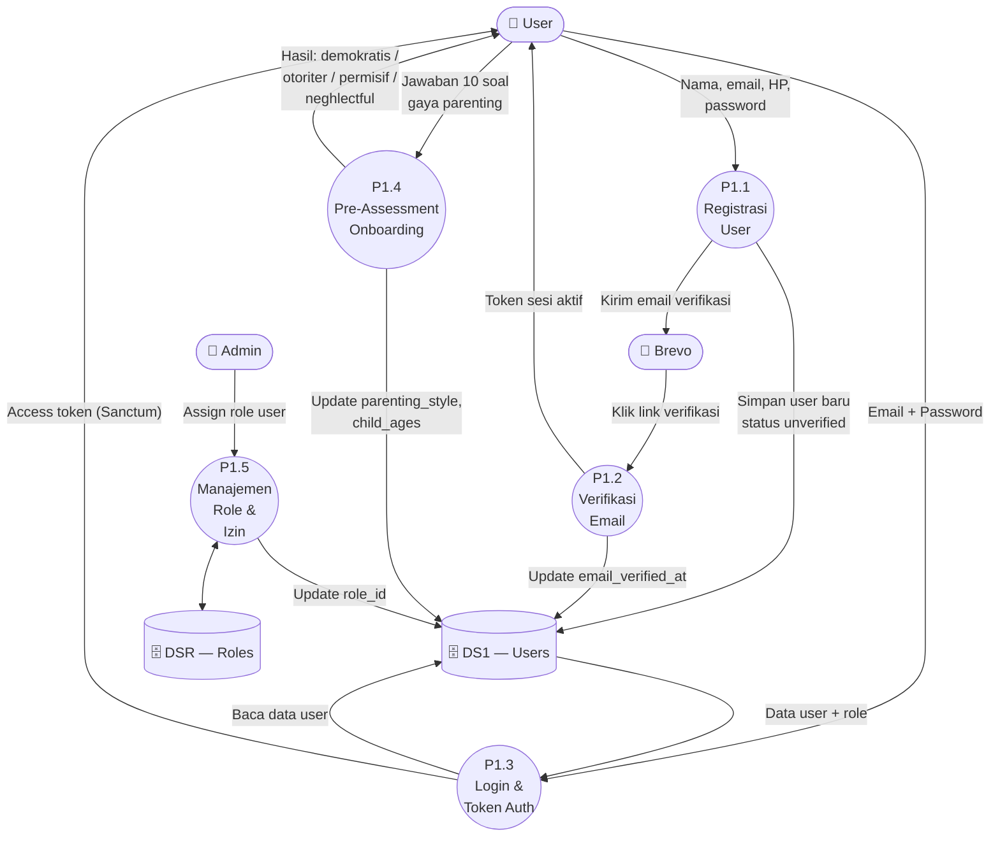
```mermaid
flowchart TD
    USER(["👤 User"])
    ADMIN(["🔧 Admin"])
    DS1[("🗄️ DS1 — Users")]
    DSR[("🗄️ DSR — Roles")]
    BREVO(["📧 Brevo"])

    P1_1(("P1.1\nRegistrasi\nUser"))
    P1_2(("P1.2\nVerifikasi\nEmail"))
    P1_3(("P1.3\nLogin &\nToken Auth"))
    P1_4(("P1.4\nPre-Assessment\nOnboarding"))
    P1_5(("P1.5\nManajemen\nRole &\nIzin"))

    USER -- "Nama, email, HP,\npassword" --> P1_1
    P1_1 -- "Simpan user baru\nstatus unverified" --> DS1
    P1_1 -- "Kirim email verifikasi" --> BREVO
    BREVO -- "Klik link verifikasi" --> P1_2
    P1_2 -- "Update email_verified_at" --> DS1
    P1_2 -- "Token sesi aktif" --> USER

    USER -- "Email + Password" --> P1_3
    P1_3 -- "Baca data user" --> DS1
    DS1 -- "Data user + role" --> P1_3
    P1_3 -- "Access token (Sanctum)" --> USER

    USER -- "Jawaban 10 soal\ngaya parenting" --> P1_4
    P1_4 -- "Update parenting_style,\nchild_ages" --> DS1
    P1_4 -- "Hasil: demokratis /\notoriter / permisif /\nneghlectful" --> USER

    ADMIN -- "Assign role user" --> P1_5
    P1_5 -- "Update role_id" --> DS1
    P1_5 <--> DSR
```

---

### 6.4 DFD Level 2 — P2: Pembelajaran E-Course

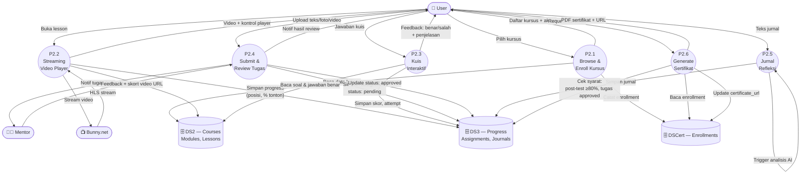
```mermaid
flowchart TD
    USER(["👤 User"])
    MENTOR(["🧑‍🏫 Mentor"])
    BUNNY(["📺 Bunny.net"])
    DS2[("🗄️ DS2 — Courses\nModules, Lessons")]
    DS3[("🗄️ DS3 — Progress\nAssignments, Journals")]
    DSCERT[("🗄️ DSCert — Enrollments")]

    P2_1(("P2.1\nBrowse &\nEnroll Kursus"))
    P2_2(("P2.2\nStreaming\nVideo Player"))
    P2_3(("P2.3\nKuis\nInteraktif"))
    P2_4(("P2.4\nSubmit &\nReview Tugas"))
    P2_5(("P2.5\nJurnal\nRefleksi"))
    P2_6(("P2.6\nGenerate\nSertifikat"))

    USER -- "Pilih kursus" --> P2_1
    P2_1 -- "Baca data kursus" --> DS2
    P2_1 -- "Catat enrollment" --> DSCERT
    P2_1 -- "Daftar kursus + akses" --> USER

    USER -- "Buka lesson" --> P2_2
    P2_2 -- "Request video URL" --> DS2
    P2_2 -- "Stream video" --> BUNNY
    BUNNY -- "HLS stream" --> P2_2
    P2_2 -- "Video + kontrol player" --> USER
    P2_2 -- "Simpan progress\n(posisi, % tonton)" --> DS3

    USER -- "Jawaban kuis" --> P2_3
    P2_3 -- "Baca soal & jawaban benar" --> DS2
    P2_3 -- "Simpan skor, attempt" --> DS3
    P2_3 -- "Feedback: benar/salah\n+ penjelasan" --> USER

    USER -- "Upload teks/foto/video" --> P2_4
    P2_4 -- "Simpan assignment\nstatus: pending" --> DS3
    P2_4 -- "Notif tugas baru" --> MENTOR
    MENTOR -- "Feedback + skor" --> P2_4
    P2_4 -- "Update status: approved" --> DS3
    P2_4 -- "Notif hasil review" --> USER

    USER -- "Teks jurnal" --> P2_5
    P2_5 -- "Simpan jurnal" --> DS3
    P2_5 -- "Trigger analisis AI" --> P2_5

    USER -- "Request sertifikat" --> P2_6
    P2_6 -- "Cek syarat:\npost-test ≥80%, tugas approved" --> DS3
    P2_6 -- "Baca enrollment" --> DSCERT
    P2_6 -- "PDF sertifikat + URL" --> USER
    P2_6 -- "Update certificate_url" --> DSCERT
```

---

### 6.5 DFD Level 2 — P3: AI & Knowledge Base (RAG System)

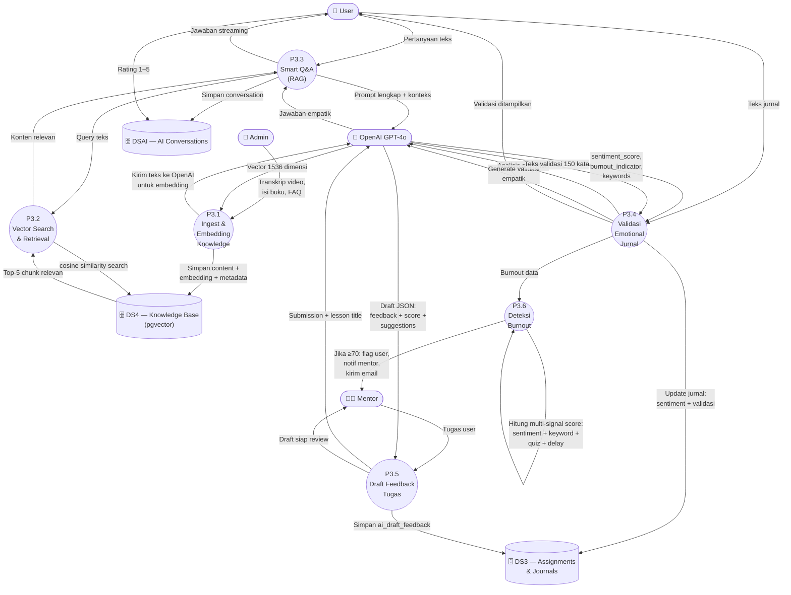
```mermaid
flowchart TD
    USER(["👤 User"])
    MENTOR(["🧑‍🏫 Mentor"])
    ADMIN(["🔧 Admin"])
    OPENAI(["🤖 OpenAI GPT-4o"])
    DS4[("🗄️ DS4 — Knowledge Base\n(pgvector)")]
    DSAI[("🗄️ DSAI — AI Conversations")]
    DS3[("🗄️ DS3 — Assignments\n& Journals")]

    P3_1(("P3.1\nIngest &\nEmbedding\nKnowledge"))
    P3_2(("P3.2\nVector Search\n& Retrieval"))
    P3_3(("P3.3\nSmart Q&A\n(RAG)"))
    P3_4(("P3.4\nValidasi\nEmotional\nJurnal"))
    P3_5(("P3.5\nDraft Feedback\nTugas"))
    P3_6(("P3.6\nDeteksi\nBurnout"))

    ADMIN -- "Transkrip video,\nisi buku, FAQ" --> P3_1
    P3_1 -- "Kirim teks ke OpenAI\nuntuk embedding" --> OPENAI
    OPENAI -- "Vector 1536 dimensi" --> P3_1
    P3_1 -- "Simpan content +\nembedding + metadata" --> DS4

    USER -- "Pertanyaan teks" --> P3_3
    P3_3 -- "Query teks" --> P3_2
    P3_2 -- "cosine similarity search" --> DS4
    DS4 -- "Top-5 chunk relevan" --> P3_2
    P3_2 -- "Konten relevan" --> P3_3
    P3_3 -- "Prompt lengkap + konteks" --> OPENAI
    OPENAI -- "Jawaban empatik" --> P3_3
    P3_3 -- "Simpan conversation" --> DSAI
    P3_3 -- "Jawaban streaming" --> USER
    USER -- "Rating 1–5" --> DSAI

    USER -- "Teks jurnal" --> P3_4
    P3_4 -- "Analisis sentimen" --> OPENAI
    OPENAI -- "sentiment_score,\nburnout_indicator,\nkeywords" --> P3_4
    P3_4 -- "Generate validasi\nempatik" --> OPENAI
    OPENAI -- "Teks validasi 150 kata" --> P3_4
    P3_4 -- "Update jurnal:\nsentiment + validasi" --> DS3
    P3_4 -- "Validasi ditampilkan" --> USER
    P3_4 -- "Burnout data" --> P3_6

    MENTOR -- "Tugas user" --> P3_5
    P3_5 -- "Submission + lesson title" --> OPENAI
    OPENAI -- "Draft JSON:\nfeedback + score +\nsuggestions" --> P3_5
    P3_5 -- "Simpan ai_draft_feedback" --> DS3
    P3_5 -- "Draft siap review" --> MENTOR

    P3_6 -- "Hitung multi-signal score:\nsentiment + keyword +\nquiz + delay" --> P3_6
    P3_6 -- "Jika ≥70: flag user,\nnotif mentor,\nkirim email" --> MENTOR
```

---

### 6.6 DFD Level 2 — P4: Pembayaran & Transaksi

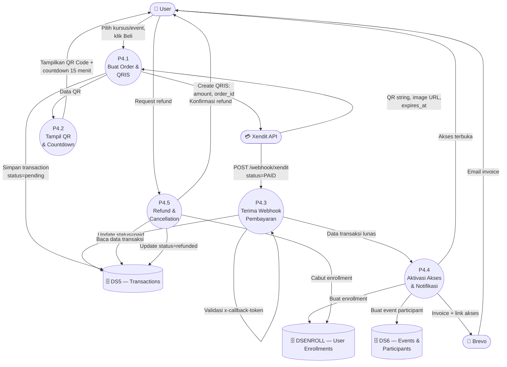
```mermaid
flowchart TD
    USER(["👤 User"])
    XENDIT(["💳 Xendit API"])
    BREVO(["📧 Brevo"])
    DS5[("🗄️ DS5 — Transactions")]
    DSENROLL[("🗄️ DSENROLL — User Enrollments")]
    DS6[("🗄️ DS6 — Events &\nParticipants")]

    P4_1(("P4.1\nBuat Order &\nQRIS"))
    P4_2(("P4.2\nTampil QR\n& Countdown"))
    P4_3(("P4.3\nTerima Webhook\nPembayaran"))
    P4_4(("P4.4\nAktivasi Akses\n& Notifikasi"))
    P4_5(("P4.5\nRefund &\nCancellation"))

    USER -- "Pilih kursus/event,\nklik Beli" --> P4_1
    P4_1 -- "Create QRIS:\namount, order_id" --> XENDIT
    XENDIT -- "QR string, image URL,\nexpires_at" --> P4_1
    P4_1 -- "Simpan transaction\nstatus=pending" --> DS5
    P4_1 -- "Data QR" --> P4_2
    P4_2 -- "Tampilkan QR Code +\ncountdown 15 menit" --> USER

    XENDIT -- "POST /webhook/xendit\nstatus=PAID" --> P4_3
    P4_3 -- "Validasi x-callback-token" --> P4_3
    P4_3 -- "Update status=paid" --> DS5
    P4_3 -- "Data transaksi lunas" --> P4_4

    P4_4 -- "Buat enrollment" --> DSENROLL
    P4_4 -- "Buat event participant" --> DS6
    P4_4 -- "Invoice + link akses" --> BREVO
    BREVO -- "Email invoice" --> USER
    P4_4 -- "Akses terbuka" --> USER

    USER -- "Request refund" --> P4_5
    P4_5 -- "Baca data transaksi" --> DS5
    P4_5 -- "Update status=refunded" --> DS5
    P4_5 -- "Cabut enrollment" --> DSENROLL
    P4_5 -- "Konfirmasi refund" --> USER
```

---

### 6.7 DFD Level 2 — P5: Manajemen Event

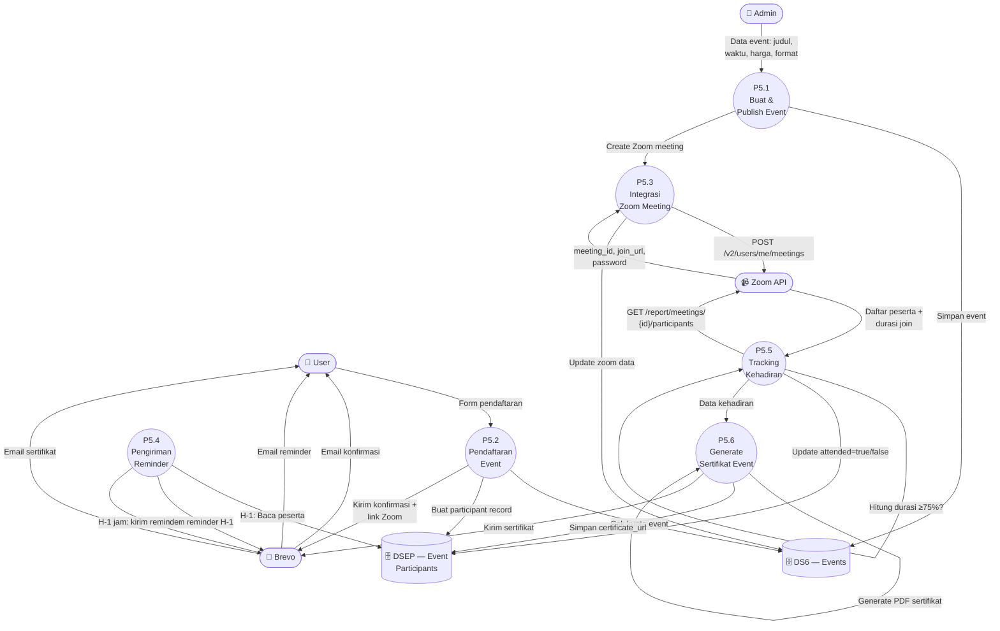
```mermaid
flowchart TD
    USER(["👤 User"])
    ADMIN(["🔧 Admin"])
    ZOOM(["📹 Zoom API"])
    BREVO(["📧 Brevo"])
    DS6[("🗄️ DS6 — Events")]
    DSEP[("🗄️ DSEP — Event\nParticipants")]

    P5_1(("P5.1\nBuat &\nPublish Event"))
    P5_2(("P5.2\nPendaftaran\nEvent"))
    P5_3(("P5.3\nIntegrasi\nZoom Meeting"))
    P5_4(("P5.4\nPengiriman\nReminder"))
    P5_5(("P5.5\nTracking\nKehadiran"))
    P5_6(("P5.6\nGenerate\nSertifikat Event"))

    ADMIN -- "Data event: judul,\nwaktu, harga, format" --> P5_1
    P5_1 -- "Simpan event" --> DS6
    P5_1 -- "Create Zoom meeting" --> P5_3
    P5_3 -- "POST /v2/users/me/meetings" --> ZOOM
    ZOOM -- "meeting_id, join_url,\npassword" --> P5_3
    P5_3 -- "Update zoom data" --> DS6

    USER -- "Form pendaftaran" --> P5_2
    P5_2 -- "Cek kuota event" --> DS6
    P5_2 -- "Buat participant record" --> DSEP
    P5_2 -- "Kirim konfirmasi +\nlink Zoom" --> BREVO
    BREVO -- "Email konfirmasi" --> USER

    P5_4 -- "H-1: Baca peserta" --> DSEP
    P5_4 -- "Kirim reminder H-1" --> BREVO
    BREVO -- "Email reminder" --> USER
    P5_4 -- "H-1 jam: kirim reminder" --> BREVO

    P5_5 -- "GET /report/meetings/\n{id}/participants" --> ZOOM
    ZOOM -- "Daftar peserta +\ndurasi join" --> P5_5
    P5_5 -- "Hitung durasi ≥75%?" --> P5_5
    P5_5 -- "Update attended=true/false" --> DSEP
    P5_5 -- "Data kehadiran" --> P5_6

    P5_6 -- "Generate PDF sertifikat" --> P5_6
    P5_6 -- "Simpan certificate_url" --> DSEP
    P5_6 -- "Kirim sertifikat" --> BREVO
    BREVO -- "Email sertifikat" --> USER
```

---

### 6.8 DFD Level 2 — P6: Distribusi Buku & Aktivasi Kode

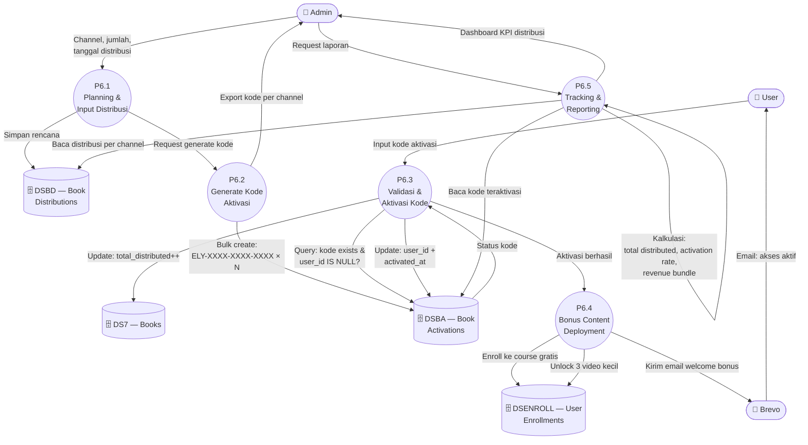
```mermaid
flowchart TD
    USER(["👤 User"])
    ADMIN(["🔧 Admin"])
    BREVO(["📧 Brevo"])
    DS7[("🗄️ DS7 — Books")]
    DSBA[("🗄️ DSBA — Book\nActivations")]
    DSBD[("🗄️ DSBD — Book\nDistributions")]
    DSENROLL[("🗄️ DSENROLL — User\nEnrollments")]

    P6_1(("P6.1\nPlanning &\nInput Distribusi"))
    P6_2(("P6.2\nGenerate Kode\nAktivasi"))
    P6_3(("P6.3\nValidasi &\nAktivasi Kode"))
    P6_4(("P6.4\nBonus Content\nDeployment"))
    P6_5(("P6.5\nTracking &\nReporting"))

    ADMIN -- "Channel, jumlah,\ntanggal distribusi" --> P6_1
    P6_1 -- "Simpan rencana" --> DSBD
    P6_1 -- "Request generate kode" --> P6_2
    P6_2 -- "Bulk create:\nELY-XXXX-XXXX-XXXX × N" --> DSBA
    P6_2 -- "Export kode per channel" --> ADMIN

    USER -- "Input kode aktivasi" --> P6_3
    P6_3 -- "Query: kode exists &\nuser_id IS NULL?" --> DSBA
    DSBA -- "Status kode" --> P6_3
    P6_3 -- "Update: user_id +\nactivated_at" --> DSBA
    P6_3 -- "Update: total_distributed++" --> DS7
    P6_3 -- "Aktivasi berhasil" --> P6_4

    P6_4 -- "Enroll ke course gratis" --> DSENROLL
    P6_4 -- "Unlock 3 video kecil" --> DSENROLL
    P6_4 -- "Kirim email welcome bonus" --> BREVO
    BREVO -- "Email: akses aktif" --> USER

    ADMIN -- "Request laporan" --> P6_5
    P6_5 -- "Baca distribusi per channel" --> DSBD
    P6_5 -- "Baca kode teraktivasi" --> DSBA
    P6_5 -- "Kalkulasi:\ntotal distributed, activation rate,\nrevenue bundle" --> P6_5
    P6_5 -- "Dashboard KPI distribusi" --> ADMIN
```

---

### 6.9 Ringkasan Data Store & Kepemilikan Proses

| Data Store | Tabel Utama | Dibaca oleh | Ditulis oleh |
|---|---|---|---|
| **DS1** Users & Roles | `users`, `roles` | P1, P2, P3, P4 | P1 (Auth), Admin |
| **DS2** Learning Content | `courses`, `modules`, `lessons`, `lesson_quizzes` | P2 | Admin |
| **DS3** Progress & Tasks | `user_progress`, `assignments`, `user_journals`, `user_enrollments` | P2, P3 | P2 (User), P3 (AI), Mentor |
| **DS4** Knowledge Base | `knowledge_base` (pgvector) | P3 (RAG) | Admin (ingest) |
| **DS4B** AI Log | `ai_conversations` | Mentor, Admin | P3 (AI) |
| **DS5** Transactions | `transactions` | P4 | P4 (Payment) |
| **DS6** Events | `events`, `event_participants` | P5 | Admin, P5 |
| **DS7** Books | `books`, `book_activations`, `book_distributions` | P6 | Admin, P6 |

---

## 7. Diagram Alir — User Journey

### 7.1 Alur Registrasi & Onboarding (Dari Buku Fisik)

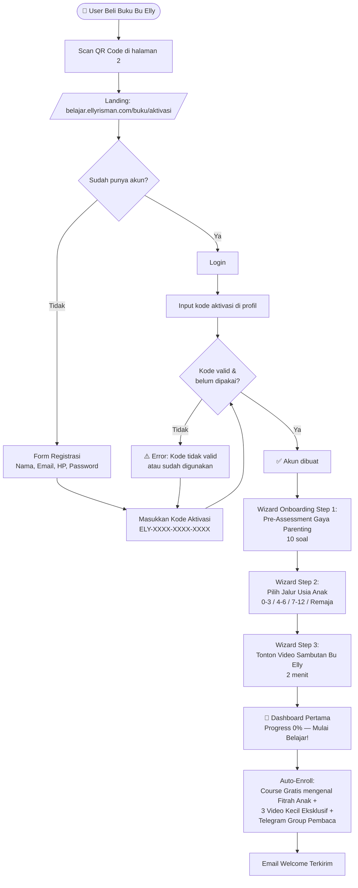
```mermaid
flowchart TD
    A([📖 User Beli Buku Bu Elly]) --> B[Scan QR Code di halaman 2]
    B --> C[/"Landing: belajar.ellyrisman.com/buku/aktivasi"/]
    C --> D{Sudah punya akun?}
    D -- Ya --> E[Login]
    D -- Tidak --> F[Form Registrasi\nNama, Email, HP, Password]
    F --> G[Masukkan Kode Aktivasi\nELY-XXXX-XXXX-XXXX]
    G --> H{Kode valid &\nbelum dipakai?}
    H -- Tidak --> I[⚠️ Error: Kode tidak valid\natau sudah digunakan]
    I --> G
    H -- Ya --> J[✅ Akun dibuat]
    E --> K[Input kode aktivasi di profil]
    K --> H
    J --> L[Wizard Onboarding Step 1:\nPre-Assessment Gaya Parenting\n10 soal]
    L --> M[Wizard Step 2:\nPilih Jalur Usia Anak\n0-3 / 4-6 / 7-12 / Remaja]
    M --> N[Wizard Step 3:\nTonton Video Sambutan Bu Elly\n2 menit]
    N --> O[🎉 Dashboard Pertama\nProgress 0% — Mulai Belajar!]
    O --> P[Auto-Enroll:\nCourse Gratis mengenal Fitrah Anak +\n3 Video Kecil Eksklusif +\nTelegram Group Pembaca]
    P --> Q[Email Welcome Terkirim]
```

### 7.2 Alur Pembelajaran Harian (2-Layer Video)


```mermaid
flowchart TD
    A([👤 User buka Dashboard]) --> B[Pilih Lesson selanjutnya]
    B --> C[▶️ Tonton VIDEO BESAR\n10–20 menit\nMateri Detail + Contoh Kasus]
    C --> D{Min Watch %\ntercapai?\ndefault 90%}
    D -- Belum --> C
    D -- Ya --> E[📝 KUIS SINGKAT\n3–5 soal pilihan ganda]
    E --> F{Skor ≥ 70%?}
    F -- Tidak --> G[Lihat penjelasan jawaban]
    G --> H{Retry setelah\ncooldown?}
    H -- Ya --> E
    H -- Tidak --> I[🔓 Tetap lanjut\ndengan catatan]
    F -- Ya --> J[📋 TUGAS PRAKTIK\nDeskripsi + instruksi]
    I --> J
    J --> K[User praktik dengan anak\ndi kehidupan nyata]
    K --> L[Upload:\nTeks cerita / Foto / Video\nmaks 2 menit]
    L --> M[AI proses:\nGenerate draft feedback +\nSkor sementara 1–100]
    M --> N[📓 JURNAL REFLEKSI\nBagaimana perasaan Bunda saat praktik?]
    N --> O[User tulis free-form journal]
    O --> P[AI analisis jurnal:\nSentiment Score + Burnout Indicator]
    P --> Q{Burnout ≥ 70?}
    Q -- Ya --> R[🚨 Flag ke Mentor Dashboard\nKirim email empatik otomatis]
    Q -- Tidak --> S[💬 AI VALIDASI PERASAAN\nRespon empatik 150 kata]
    R --> S
    S --> T[▶️ Tonton VIDEO KECIL\n2–5 menit\nBu Elly bicara langsung + empati]
    T --> U{Tugas sudah\ndi-review mentor?}
    U -- Belum --> V[⏳ Notif: Menunggu review\nmaks 24 jam]
    U -- Ya --> W[📬 Notif email:\nTugas dinilai — Skor + Feedback]
    W --> X{Semua lesson\ndalam modul selesai?}
    V --> X
    X -- Belum --> A
    X -- Ya --> Y[🎉 Modul Selesai!\nConfetti animation]
    Y --> Z{Semua modul\nselesai?}
    Z -- Belum --> A
    Z -- Ya --> AA[📝 POST-TEST\nmaks 3x attempt, cooldown 24 jam]
    AA --> BB{Skor ≥ 80%?}
    BB -- Tidak --> CC[Review materi]
    CC --> AA
    BB -- Ya --> DD[🏆 SERTIFIKAT DIGITAL\nPDF + Link download]
    DD --> EE[Email sertifikat + CTA share Instagram\ndapat diskon 20% course berikutnya]
```

### 7.3 Alur Registrasi & Pembayaran Event

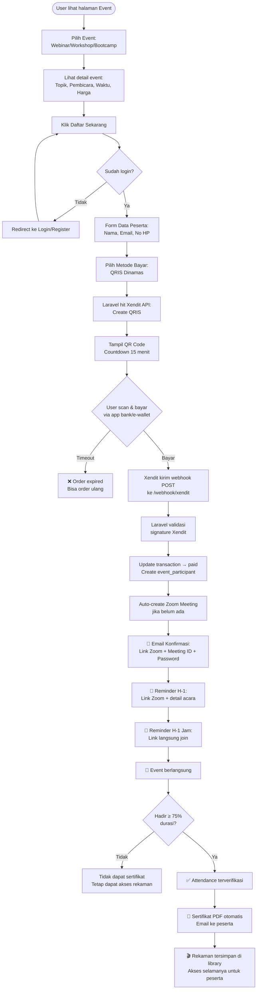
```mermaid
flowchart TD
    A([User lihat halaman Event]) --> B[Pilih Event:\nWebinar/Workshop/Bootcamp]
    B --> C[Lihat detail event:\nTopik, Pembicara, Waktu, Harga]
    C --> D[Klik Daftar Sekarang]
    D --> E{Sudah login?}
    E -- Tidak --> F[Redirect ke Login/Register]
    F --> D
    E -- Ya --> G[Form Data Peserta:\nNama, Email, No HP]
    G --> H[Pilih Metode Bayar:\nQRIS Dinamas]
    H --> I[Laravel hit Xendit API:\nCreate QRIS]
    I --> J[Tampil QR Code\nCountdown 15 menit]
    J --> K{User scan & bayar\nvia app bank/e-wallet}
    K -- Timeout --> L[❌ Order expired\nBisa order ulang]
    K -- Bayar --> M[Xendit kirim webhook POST\nke /webhook/xendit]
    M --> N[Laravel validasi\nsignature Xendit]
    N --> O[Update transaction → paid\nCreate event_participant]
    O --> P[Auto-create Zoom Meeting\njika belum ada]
    P --> Q[📧 Email Konfirmasi:\nLink Zoom + Meeting ID + Password]
    Q --> R[📧 Reminder H-1:\nLink Zoom + detail acara]
    R --> S[📧 Reminder H-1 Jam:\nLink langsung join]
    S --> T[🎤 Event berlangsung]
    T --> U{Hadir ≥ 75%\ndurasi?}
    U -- Tidak --> V[Tidak dapat sertifikat\nTetap dapat akses rekaman]
    U -- Ya --> W[✅ Attendance terverifikasi]
    W --> X[📜 Sertifikat PDF otomatis\nEmail ke peserta]
    X --> Y[🎬 Rekaman tersimpan di library\nAkses selamanya untuk peserta]
```

---

## 8. Diagram Alir — Proses Bisnis Utama

### 8.1 Alur AI RAG (Smart Q&A)

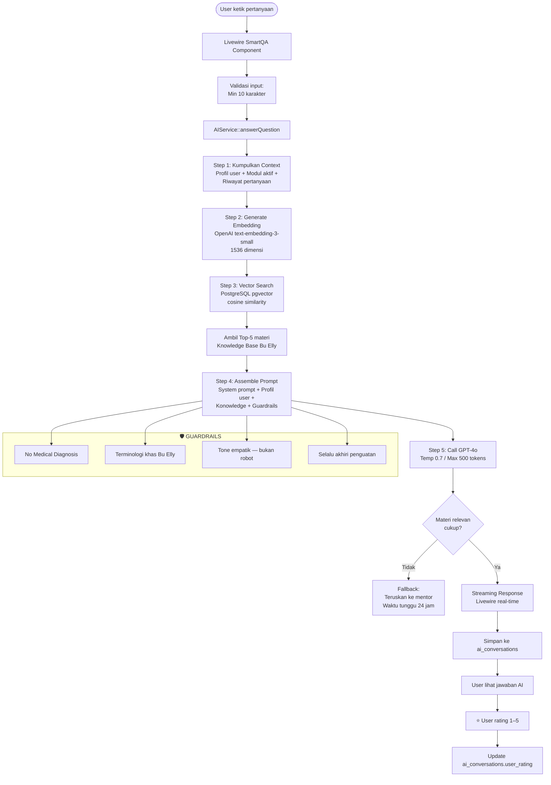
```mermaid
flowchart TD
    A([User ketik pertanyaan]) --> B[Livewire SmartQA Component]
    B --> C[Validasi input:\nMin 10 karakter]
    C --> D[AIService::answerQuestion]
    D --> E[Step 1: Kumpulkan Context\nProfil user + Modul aktif +\nRiwayat pertanyaan]
    E --> F[Step 2: Generate Embedding\nOpenAI text-embedding-3-small\n1536 dimensi]
    F --> G[Step 3: Vector Search\nPostgreSQL pgvector\ncosine similarity]
    G --> H[Ambil Top-5 materi\nKnowledge Base Bu Elly]
    H --> I[Step 4: Assemble Prompt\nSystem prompt + Profil user +\nKonowledge + Guardrails]
    I --> J[Step 5: Call GPT-4o\nTemp 0.7 / Max 500 tokens]
    J --> K{Materi relevan\ncukup?}
    K -- Tidak --> L[Fallback:\nTeruskan ke mentor\nWaktu tunggu 24 jam]
    K -- Ya --> M[Streaming Response\nLivewire real-time]
    M --> N[Simpan ke ai_conversations]
    N --> O[User lihat jawaban AI]
    O --> P[⭐ User rating 1–5]
    P --> Q[Update ai_conversations.user_rating]

    subgraph "🛡️ GUARDRAILS"
        G1[No Medical Diagnosis]
        G2[Terminologi khas Bu Elly]
        G3[Tone empatik — bukan robot]
        G4[Selalu akhiri penguatan]
    end

    I --> G1
    I --> G2
    I --> G3
    I --> G4
```

### 8.2 Alur Deteksi & Penanganan Burnout

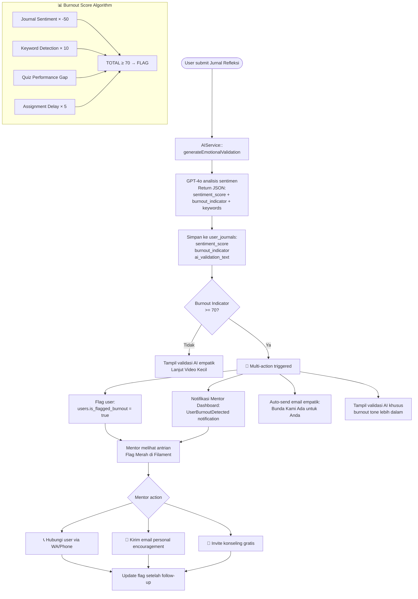
```mermaid
flowchart TD
    A([User submit Jurnal Refleksi]) --> B[AIService::\ngenerateEmotionalValidation]
    B --> C[GPT-4o analisis sentimen\nReturn JSON:\nsentiment_score + burnout_indicator + keywords]
    C --> D[Simpan ke user_journals:\nsentiment_score\nburnout_indicator\nai_validation_text]
    D --> E{Burnout Indicator\n>= 70?}
    E -- Tidak --> F[Tampil validasi AI empatik\nLanjut Video Kecil]
    E -- Ya --> G[🚨 Multi-action triggered]
    G --> H[Flag user:\nusers.is_flagged_burnout = true]
    G --> I[Notifikasi Mentor Dashboard:\nUserBurnoutDetected notification]
    G --> J[Auto-send email empatik:\nBunda Kami Ada untuk Anda]
    G --> K[Tampil validasi AI khusus\nburnout tone lebih dalam]
    H --> L[Mentor melihat antrian\nFlag Merah di Filament]
    I --> L
    L --> M{Mentor action}
    M --> N[📞 Hubungi user via WA/Phone]
    M --> O[📧 Kirim email personal encouragement]
    M --> P[🔗 Invite konseling gratis]
    N --> Q[Update flag setelah follow-up]
    O --> Q
    P --> Q

    subgraph "📊 Burnout Score Algorithm"
        BA[Journal Sentiment × -50]
        BB[Keyword Detection × 10]
        BC[Quiz Performance Gap]
        BD[Assignment Delay × 5]
        BE[TOTAL ≥ 70 → FLAG]
        BA --> BE
        BB --> BE
        BC --> BE
        BD --> BE
    end
```

### 8.3 Alur Review Tugas Mentor + AI

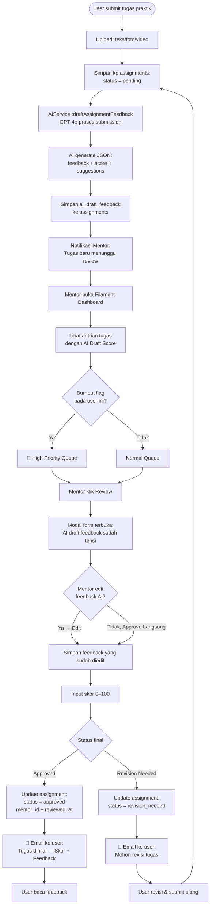
```mermaid
flowchart TD
    A([User submit tugas praktik]) --> B[Upload: teks/foto/video]
    B --> C[Simpan ke assignments:\nstatus = pending]
    C --> D[AIService::draftAssignmentFeedback\nGPT-4o proses submission]
    D --> E[AI generate JSON:\nfeedback + score + suggestions]
    E --> F[Simpan ai_draft_feedback\nke assignments]
    F --> G[Notifikasi Mentor:\nTugas baru menunggu review]
    G --> H[Mentor buka Filament Dashboard]
    H --> I[Lihat antrian tugas\ndengan AI Draft Score]
    I --> J{Burnout flag\npada user ini?}
    J -- Ya --> K[🚨 High Priority Queue]
    J -- Tidak --> L[Normal Queue]
    K --> M[Mentor klik Review]
    L --> M
    M --> N[Modal form terbuka:\nAI draft feedback sudah terisi]
    N --> O{Mentor edit\nfeedback AI?}
    O -- Ya → Edit --> P[Simpan feedback yang sudah diedit]
    O -- Tidak, Approve Langsung --> P
    P --> Q[Input skor 0–100]
    Q --> R{Status final}
    R -- Approved --> S[Update assignment:\nstatus = approved\nmentor_id + reviewed_at]
    R -- Revision Needed --> T[Update assignment:\nstatus = revision_needed]
    S --> U[📧 Email ke user:\nTugas dinilai — Skor + Feedback]
    T --> V[📧 Email ke user:\nMohon revisi tugas]
    U --> W[User baca feedback]
    V --> X[User revisi & submit ulang]
    X --> C
```

### 8.4 Alur Distribusi Buku & Aktivasi Kode

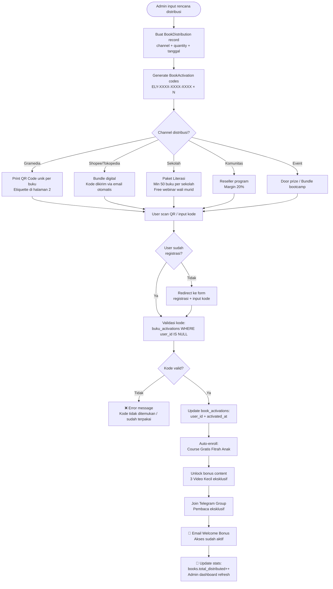
```mermaid
flowchart TD
    A([Admin input rencana distribusi]) --> B[Buat BookDistribution record\nchannel + quantity + tanggal]
    B --> C[Generate BookActivation codes\nELY-XXXX-XXXX-XXXX × N]
    C --> D{Channel distribusi?}
    D -- Gramedia --> E[Print QR Code unik per buku\nEtiquette di halaman 2]
    D -- Shopee/Tokopedia --> F[Bundle digital\nKode dikirim via email otomatis]
    D -- Sekolah --> G[Paket Literasi\nMin 50 buku per sekolah\nFree webinar wali murid]
    D -- Komunitas --> H[Reseller program\nMargin 20%]
    D -- Event --> I[Door prize / Bundle bootcamp]
    E --> J[User scan QR / input kode]
    F --> J
    G --> J
    H --> J
    I --> J
    J --> K{User sudah\nregistrasi?}
    K -- Tidak --> L[Redirect ke form\nregistrasi + input kode]
    K -- Ya --> M[Validasi kode:\nbuku_activations WHERE user_id IS NULL]
    L --> M
    M --> N{Kode valid?}
    N -- Tidak --> O[❌ Error message\nKode tidak ditemukan / sudah terpakai]
    N -- Ya --> P[Update book_activations:\nuser_id + activated_at]
    P --> Q[Auto-enroll:\nCourse Gratis Fitrah Anak]
    Q --> R[Unlock bonus content\n3 Video Kecil eksklusif]
    R --> S[Join Telegram Group\nPembaca eksklusif]
    S --> T[📧 Email Welcome Bonus\nAkses sudah aktif]
    T --> U[🔄 Update stats:\nbooks.total_distributed++\nAdmin dashboard refresh]
```

### 8.5 Alur Payment QRIS Dinamas

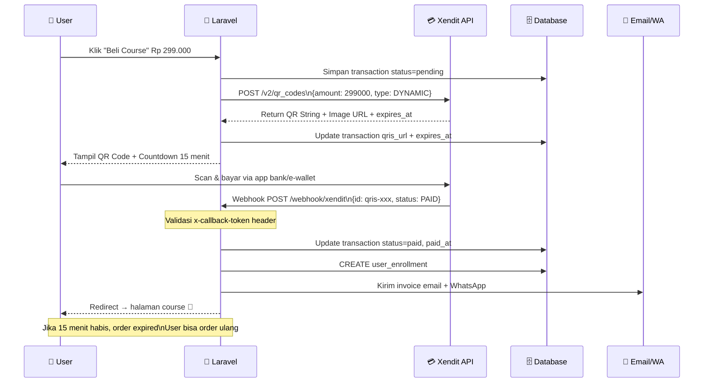
```mermaid
sequenceDiagram
    participant U as 👤 User
    participant L as 🐘 Laravel
    participant X as 💳 Xendit API
    participant DB as 🗄️ Database
    participant E as 📧 Email/WA

    U->>L: Klik "Beli Course" Rp 299.000
    L->>DB: Simpan transaction status=pending
    L->>X: POST /v2/qr_codes\n{amount: 299000, type: DYNAMIC}
    X-->>L: Return QR String + Image URL + expires_at
    L->>DB: Update transaction qris_url + expires_at
    L-->>U: Tampil QR Code + Countdown 15 menit

    U->>X: Scan & bayar via app bank/e-wallet
    X->>L: Webhook POST /webhook/xendit\n{id: qris-xxx, status: PAID}

    Note over L: Validasi x-callback-token header

    L->>DB: Update transaction status=paid, paid_at
    L->>DB: CREATE user_enrollment
    L->>E: Kirim invoice email + WhatsApp
    L-->>U: Redirect → halaman course 🎉

    Note over U,L: Jika 15 menit habis, order expired\nUser bisa order ulang
```

### 8.6 Alur Zoom Integration (Event)

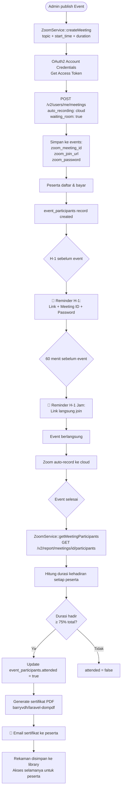
```mermaid
flowchart TD
    A([Admin publish Event]) --> B[ZoomService::createMeeting\ntopic + start_time + duration]
    B --> C[OAuth2 Account Credentials\nGet Access Token]
    C --> D[POST /v2/users/me/meetings\nauto_recording: cloud\nwaiting_room: true]
    D --> E[Simpan ke events:\nzoom_meeting_id\nzoom_join_url\nzoom_password]
    E --> F[Peserta daftar & bayar]
    F --> G[event_participants record created]
    G --> H{H-1 sebelum event}
    H --> I[📧 Reminder H-1:\nLink + Meeting ID + Password]
    I --> J{60 menit sebelum event}
    J --> K[📧 Reminder H-1 Jam:\nLink langsung join]
    K --> L[Event berlangsung]
    L --> M[Zoom auto-record ke cloud]
    M --> N{Event selesai}
    N --> O[ZoomService::getMeetingParticipants\nGET /v2/report/meetings/id/participants]
    O --> P[Hitung durasi kehadiran setiap peserta]
    P --> Q{Durasi hadir\n≥ 75% total?}
    Q -- Ya --> R[Update event_participants.attended = true]
    Q -- Tidak --> S[attended = false]
    R --> T[Generate sertifikat PDF\nbarryvdh/laravel-dompdf]
    T --> U[📧 Email sertifikat ke peserta]
    U --> V[Rekaman disimpan ke library\nAkses selamanya untuk peserta]
```

---

## 9. Spesifikasi Fitur Detail

### FR-01 — Modul E-Course

| ID | Fitur | Deskripsi | Prioritas |
|---|---|---|---|
| FR-01-01 | Video Player Custom | Embed Bunny.net, tidak bisa skip sebelum selesai, bookmark otomatis, speed control 0.75x–1.5x | P0 |
| FR-01-02 | Progress Tracking | Progress bar per modul, estimasi waktu tersisa, "next lesson" recommendation | P0 |
| FR-01-03 | Kuis Interaktif | Instant feedback, unlimited attempts dengan cooldown, penjelasan jawaban | P0 |
| FR-01-04 | Tugas Praktik | Upload teks/foto/video, AI draft feedback, mentor review | P0 |
| FR-01-05 | Jurnal Refleksi | Free-form text, AI analisis sentimen, deteksi burnout | P0 |
| FR-01-06 | Validasi AI Empatik | Respon empatik 150 kata setelah jurnal, trigger Video Kecil | P0 |
| FR-01-07 | Sertifikat Otomatis | Post-test ≥ 80%, semua tugas approved, PDF download | P1 |
| FR-01-08 | Pre-Test & Post-Test | Asesmen gaya parenting, mapping ke 4 jenis (otoriter/permisif/demokratis/neglectful) | P0 |

### FR-02 — Smart Q&A (AI Bu Elly)

| ID | Fitur | Deskripsi | Prioritas |
|---|---|---|---|
| FR-02-01 | RAG Answer Engine | Vector search pgvector + GPT-4o, streaming response real-time | P0 |
| FR-02-02 | User Rating | Rating 1–5 untuk setiap jawaban AI | P1 |
| FR-02-03 | Fallback ke Mentor | Jika AI tidak yakin, buat QnA thread untuk mentor | P0 |
| FR-02-04 | Forum Publik | Pertanyaan publik, nested replies, rich text, upvote | P1 |
| FR-02-05 | Tagging & Pencarian | Tag per topik, search keyword, filter populer | P1 |

### FR-03 — Modul Event

| ID | Fitur | Deskripsi | Prioritas |
|---|---|---|---|
| FR-03-01 | Pendaftaran Event | Form peserta, QRIS Dinamas, auto-confirm email | P0 |
| FR-03-02 | Zoom Integration | Auto-create meeting, send join link, attendance tracking | P0 |
| FR-03-03 | QR Absensi (Offline) | QR Code check-in untuk event offline | P1 |
| FR-03-04 | Sertifikat Event | Template per jenis event, auto-generate PDF, email otomatis | P1 |
| FR-03-05 | Library Rekaman | Simpan rekaman webinar, akses selamanya, bisa dijual terpisah | P1 |

### FR-04 — Dashboard Mentor (Filament)

| ID | Fitur | Deskripsi | Prioritas |
|---|---|---|---|
| FR-04-01 | Antrian Tugas | Tabel searchable, filter status, AI draft score tampil | P0 |
| FR-04-02 | Review & Approve | Modal review dengan AI draft, input skor, kirim ke user | P0 |
| FR-04-03 | Flag Merah Burnout | Tabel user dengan burnout ≥ 70, action call/email/invite konseling | P0 |
| FR-04-04 | Monitor Progres | Tabel user "stuck" > 7 hari, stats: completion rate, avg score | P1 |
| FR-04-05 | Q&A Management | Manage thread, review AI draft jawaban, mark answered | P1 |
| FR-04-06 | Statistik Engagement | Charts: completion rate, submission rate, Q&A activity, active hours | P1 |

### FR-05 — Buku & Aktivasi Kode

| ID | Fitur | Deskripsi | Prioritas |
|---|---|---|---|
| FR-05-01 | Generate Kode | Bulk generate ELY-XXXX-XXXX-XXXX per channel distribusi | P0 |
| FR-05-02 | Aktivasi Kode | Validasi kode, auto-enroll course gratis + bonus content | P0 |
| FR-05-03 | Tracking Distribusi | Dashboard distribusi per channel, activation rate, revenue bundle | P1 |
| FR-05-04 | Bundle Buku + Course | SKU khusus, voucher, redeem di platform | P1 |

### FR-06 — Notifikasi & Email

| ID | Template | Trigger | Prioritas |
|---|---|---|---|
| FR-06-01 | Welcome Email | Registrasi berhasil | P0 |
| FR-06-02 | Invoice Email | Pembayaran berhasil | P0 |
| FR-06-03 | Tugas Dinilai | Mentor approve/revision | P0 |
| FR-06-04 | Reminder Event H-1 | Otomatis scheduled job | P0 |
| FR-06-05 | Reminder Event H-1 Jam | Otomatis scheduled job | P0 |
| FR-06-06 | Sertifikat Ready | Post-test lulus & kursus selesai | P0 |
| FR-06-07 | Encouragement Email | Burnout indicator ≥ 70 | P0 |
| FR-06-08 | Newsletter Mingguan | Setiap Senin pagi | P1 |

---

## 10. Non-Functional Requirements

### 9.1 Performance

| Metrik | Target | Cara Ukur |
|---|---|---|
| Page Load Time | < 2 detik | Google PageSpeed Insights |
| Video Start Time | < 3 detik | Bunny.net Analytics |
| API Response Time | < 500ms | Laravel Telescope |
| AI Response (Q&A) | < 5 detik | Application log |
| Concurrent Users | 500+ tanpa degradasi | Load testing (k6) |

### 9.2 Reliability & Availability

| Metrik | Target |
|---|---|
| Uptime | > 99.5% per bulan |
| Recovery Time Objective (RTO) | < 1 jam |
| Recovery Point Objective (RPO) | < 24 jam (daily backup) |
| Error Rate | < 0.1% per hari |

### 9.3 Security

- HTTPS wajib (SSL via Cloudflare)
- OWASP Top 10 mitigation
- Input sanitization (SQL injection, XSS)
- Rate limiting API endpoint
- Payment webhook signature validation
- Enkripsi password (bcrypt)
- CSRF protection (Laravel built-in)
- Role-based access control (Spatie Permission)

### 9.4 Scalability

- Stateless application layer (siap horizontal scaling)
- Queue workers terpisah dari web server
- Redis untuk session & cache (tidak di database)
- Video hosting off-load ke Bunny.net CDN
- Database connection pooling

### 9.5 Accessibility

- Responsive design (mobile-first)
- Font size minimal 16px untuk teks konten
- Kontras warna memenuhi WCAG AA
- Video player mendukung subtitel (future)

---

## 11. Acceptance Criteria

### AC-01: Sistem Video Player

```gherkin
Given user sudah enroll course
When user membuka halaman lesson
Then video Bunny.net ter-embed dengan benar
And video tidak bisa skip pada first-time watch
And progress tersimpan otomatis setiap 30 detik (bookmark)
And kuis muncul setelah video selesai ≥ 90% watched
```

### AC-02: Sistem Pembayaran QRIS

```gherkin
Given user memilih course berbayar
When user klik "Beli Sekarang"
Then QR Code Xendit muncul dalam < 3 detik
And countdown 15 menit dimulai
When user berhasil scan & bayar
Then webhook diterima dalam < 10 detik
And user ter-enroll otomatis ke course
And email invoice terkirim dalam < 1 menit
```

### AC-03: AI Smart Q&A

```gherkin
Given user mengetik pertanyaan > 10 karakter
When user klik "Tanya Sekarang"
Then spinner "Sedang berpikir..." muncul
And jawaban AI muncul dengan streaming (real-time character)
And response time < 5 detik untuk pertanyaan normal
And jawaban menggunakan terminologi khas Bu Elly
And jawaban tidak pernah menyebut diagnosis medis
```

### AC-04: Burnout Detection

```gherkin
Given user menulis jurnal refleksi
When AI menganalisis sentimen
And burnout_indicator >= 70
Then mentor mendapat notifikasi real-time di dashboard
And email empatik otomatis terkirim ke user
And user.is_flagged_burnout = true
And user masuk antrian high priority mentor
```

### AC-05: Sertifikat

```gherkin
Given user sudah menyelesaikan semua lesson
And semua tugas berstatus "approved"
And post-test score >= 80
When kondisi di atas terpenuhi
Then sertifikat PDF ter-generate otomatis
And email sertifikat terkirim dalam < 5 menit
And user bisa download sertifikat dari dashboard
```

### AC-06: Aktivasi Kode Buku

```gherkin
Given user memiliki kode aktivasi ELY-XXXX-XXXX-XXXX
When user input kode di form aktivasi
And kode valid dan belum pernah dipakai
Then user ter-enroll ke course gratis "Mengenal Fitrah Anak"
And 3 video kecil eksklusif ter-unlock
And book_activations record terupdate dengan user_id
```

---

## 12. Roadmap Implementasi

### Sprint Overview

```mermaid
gantt
    title Roadmap Implementasi Akademi Parenting (12 Minggu)
    dateFormat  YYYY-MM-DD
    section Fase 1 — Fondasi
    Setup Server + Laravel + DB          :done, f1, 2026-10-06, 7d
    Migrasi DB + Seed + Bunny.net        :done, f2, 2026-10-13, 7d
    section Fase 2 — Core Features
    Landing Page + Auth + Dashboard      :active, f3, 2026-10-20, 7d
    Video Player + Kuis + Tugas + Jurnal :f4, 2026-10-27, 7d
    section Fase 3 — Monetization
    Xendit QRIS + Checkout + Webhook     :f5, 2026-11-03, 7d
    Bundle Buku + Voucher + Laporan      :f6, 2026-11-10, 7d
    section Fase 4 — AI Integration
    pgvector + Knowledge Base + Embeddings :f7, 2026-11-17, 7d
    Smart Q&A + Validasi + AI Burnout    :f8, 2026-11-24, 7d
    section Fase 5 — Mentor & Event
    Filament Mentor Dashboard            :f9, 2026-12-01, 7d
    Modul Event + Zoom + Absensi         :f10, 2026-12-08, 7d
    section Fase 6 — Testing & Launch
    Load Testing + Security + UAT        :f11, 2026-12-15, 7d
    Beta (100 user) + Bug Fix + Launch   :f12, 2026-12-22, 7d
```

### Milestone & Kriteria Sukses

| Milestone | Deadline | Kriteria Sukses |
|---|---|---|
| **M1 — Fondasi** | Minggu 2 | Server up, DB schema final, Filament login berjalan |
| **M2 — Core Features** | Minggu 4 | User bisa daftar, nonton video, jawab kuis, submit tugas |
| **M3 — Monetization** | Minggu 6 | QRIS live, webhook berjalan, auto-enroll setelah bayar |
| **M4 — AI Ready** | Minggu 8 | Smart Q&A akurat >85%, response <5 detik |
| **M5 — Beta Launch** | Minggu 11 | 100 beta tester aktif, completion rate >60%, error <5% |
| **M6 — Grand Launch** | Minggu 12 | Press release, target 1.000 registrasi minggu pertama |

---

## 13. KPI & Metrik Keberhasilan

### 12.1 KPI Bisnis

| KPI | Target 6 Bulan | Target 12 Bulan | Query |
|---|---|---|---|
| Distribusi Buku | 3.000 eks. | 6.000 eks. | `SELECT SUM(quantity) FROM book_distributions` |
| User Terdaftar | 2.000 | 10.000 | `SELECT COUNT(*) FROM users` |
| MAU (Monthly Active Users) | 800 | 5.000 | `SELECT COUNT(DISTINCT user_id) FROM user_progress WHERE updated_at >= NOW() - INTERVAL '30 days'` |
| Revenue E-Course | Rp 150 juta | Rp 500 juta | `SELECT SUM(amount) FROM transactions WHERE course_id IS NOT NULL AND status='paid'` |
| Revenue Event | Rp 100 juta | Rp 300 juta | `SELECT SUM(amount) FROM transactions WHERE event_id IS NOT NULL AND status='paid'` |
| Konversi Buku → User | 20% | 35% | `(Kode diaktivasi / total distribusi) * 100` |

### 12.2 KPI Engagement

| Metrik | Target | Cara Ukur |
|---|---|---|
| Completion Rate E-Course | > 60% | User selesai / User enroll × 100 |
| Avg Session Duration | > 20 menit | Analytics log |
| Quiz Pass Rate | > 80% | User lulus / Total attempts × 100 |
| Assignment Submission Rate | > 70% | Tugas submitted / Total tugas × 100 |
| Journal Reflection Rate | > 50% | User isi jurnal / User selesai lesson × 100 |

### 12.3 KPI AI Performance

| Metrik | Target | Cara Ukur |
|---|---|---|
| AI Response Accuracy | > 90% | Mentor rating ≥ 4.5/5 rata-rata |
| AI Draft Acceptance Rate | > 70% | Draft di-approve tanpa edit / Total draft × 100 |
| Burnout Detection Precision | > 85% | True positive / (TP + FP) × 100 |
| User Satisfaction AI | > 4.2/5 | Rating user setelah dapat jawaban AI |

---

## 14. Risiko & Mitigasi

```mermaid
quadrantChart
    title Risk Matrix — Akademi Parenting Platform
    x-axis Low Probability --> High Probability
    y-axis Low Impact --> High Impact
    quadrant-1 Monitor
    quadrant-2 Mitigate Immediately
    quadrant-3 Accept
    quadrant-4 Contingency Plan

    AI Hallucination: [0.5, 0.8]
    Video Buffering: [0.6, 0.7]
    Mentor Overload: [0.7, 0.6]
    Payment Failure: [0.4, 0.7]
    Server Downtime: [0.2, 0.9]
    Data Breach: [0.2, 0.95]
    Low Adoption Rate: [0.4, 0.6]
    Burnout False Positive: [0.5, 0.4]
```

| Risiko | Dampak | Probabilitas | Mitigasi |
|---|---|---|---|
| **AI Hallucination** | User dapat info salah | Medium | RAG strict + guardrails + human review mandatory |
| **Video Buffering** | User frustrasi, churn | High | Bunny.net CDN + multiple quality + preload |
| **Mentor Overload** | Feedback lambat >24 jam | High | AI auto-draft (80% faster) + SLA monitoring + recruit mentor |
| **Payment Gagal** | Revenue loss | Medium | Webhook retry + manual verify backup + support standby |
| **Server Downtime** | Platform offline | Low | DigitalOcean SLA 99.9% + monitoring UptimeRobot + backup |
| **Data Breach** | Reputasi hancur | Low | SSL + Cloudflare WAF + security audit berkala |
| **Low Adoption** | ROI negatif | Medium | Reverse funnel buku + affiliate 100 orang + content marketing |
| **Burnout False Positive** | Mentor overalert | Medium | Threshold calibration + multi-signal scoring |

---

## Lampiran A — Struktur Folder Proyek

```
akademi-parenting/
├── app/
│   ├── Filament/
│   │   ├── Resources/
│   │   │   ├── UserResource.php
│   │   │   ├── CourseResource.php
│   │   │   ├── AssignmentResource.php
│   │   │   ├── EventResource.php
│   │   │   └── BookDistributionResource.php
│   │   └── Widgets/
│   │       ├── BookDistributionOverview.php
│   │       ├── BurnoutAlertWidget.php
│   │       └── EngagementStatsWidget.php
│   ├── Livewire/
│   │   ├── Auth/
│   │   │   ├── Login.php
│   │   │   └── Register.php
│   │   ├── Course/
│   │   │   ├── CourseCatalog.php
│   │   │   ├── VideoPlayer.php
│   │   │   ├── QuizInteractive.php
│   │   │   ├── AssignmentSubmission.php
│   │   │   └── JournalReflection.php
│   │   ├── Dashboard/
│   │   │   ├── UserDashboard.php
│   │   │   └── ProgressTracker.php
│   │   ├── Event/
│   │   │   ├── EventCatalog.php
│   │   │   └── EventRegistration.php
│   │   └── AI/
│   │       └── SmartQA.php
│   ├── Models/
│   │   ├── User.php
│   │   ├── Course.php
│   │   ├── Module.php
│   │   ├── Lesson.php
│   │   ├── LessonQuiz.php
│   │   ├── UserEnrollment.php
│   │   ├── UserProgress.php
│   │   ├── Assignment.php
│   │   ├── UserJournal.php
│   │   ├── KnowledgeBase.php
│   │   ├── AiConversation.php
│   │   ├── Transaction.php
│   │   ├── Event.php
│   │   ├── EventParticipant.php
│   │   ├── Book.php
│   │   ├── BookActivation.php
│   │   └── BookDistribution.php
│   ├── Services/
│   │   ├── AIService.php
│   │   ├── ZoomService.php
│   │   ├── BunnyService.php
│   │   └── CertificateService.php
│   ├── Jobs/
│   │   ├── ProcessJournalSentiment.php
│   │   ├── GenerateAIFeedbackDraft.php
│   │   ├── SendEventReminder.php
│   │   └── GenerateCertificate.php
│   ├── Notifications/
│   │   ├── UserBurnoutDetected.php
│   │   ├── AssignmentReviewed.php
│   │   └── EventReminderNotification.php
│   └── Mail/
│       ├── WelcomeEmail.php
│       ├── PaymentSuccessEmail.php
│       ├── EventReminderEmail.php
│       ├── AssignmentReviewedEmail.php
│       ├── CertificateEmail.php
│       └── EncouragementEmail.php
├── database/
│   ├── migrations/
│   │   ├── 001_create_roles_table.php
│   │   ├── 002_create_users_table.php
│   │   ├── 003_create_courses_table.php
│   │   ├── 004_create_modules_table.php
│   │   ├── 005_create_lessons_table.php
│   │   ├── 006_create_lesson_quizzes_table.php
│   │   ├── 007_create_user_enrollments_table.php
│   │   ├── 008_create_user_progress_table.php
│   │   ├── 009_create_assignments_table.php
│   │   ├── 010_create_user_journals_table.php
│   │   ├── 011_create_knowledge_base_table.php  ← pgvector
│   │   ├── 012_create_ai_conversations_table.php
│   │   ├── 013_create_transactions_table.php
│   │   ├── 014_create_events_table.php
│   │   ├── 015_create_event_participants_table.php
│   │   ├── 016_create_books_table.php
│   │   ├── 017_create_book_activations_table.php
│   │   └── 018_create_book_distributions_table.php
│   └── seeders/
│       ├── RoleSeeder.php
│       ├── AdminSeeder.php
│       └── SampleCourseSeeder.php
├── resources/
│   ├── views/
│   │   ├── livewire/
│   │   │   ├── course/
│   │   │   ├── dashboard/
│   │   │   ├── event/
│   │   │   └── ai/
│   │   ├── emails/
│   │   │   ├── welcome.blade.php
│   │   │   ├── payment-success.blade.php
│   │   │   ├── event-reminder.blade.php
│   │   │   └── encouragement.blade.php
│   │   └── pdf/
│   │       ├── certificate-course.blade.php
│   │       └── certificate-event.blade.php
│   └── css/
│       └── app.css
├── routes/
│   ├── web.php
│   ├── api.php
│   └── console.php  ← Scheduled jobs
└── tests/
    ├── Feature/
    │   ├── PaymentWebhookTest.php
    │   ├── AIServiceTest.php
    │   └── BookActivationTest.php
    └── Unit/
        └── BurnoutScoreTest.php
```

---

## Lampiran B — Composer Dependencies

```json
{
  "require": {
    "php": "^8.2",
    "laravel/framework": "^11.0",
    "laravel/sanctum": "^4.0",
    "filament/filament": "^3.0",
    "spatie/laravel-permission": "^6.0",
    "openai-php/laravel": "^0.8",
    "getbrevo/brevo-php": "^1.0",
    "firebase/php-jwt": "^6.0",
    "intervention/image": "^3.0",
    "barryvdh/laravel-dompdf": "^2.0",
    "laravel/telescope": "^5.0",
    "sentry/sentry-laravel": "^4.0",
    "livewire/livewire": "^3.0"
  },
  "require-dev": {
    "pestphp/pest": "^2.0",
    "pestphp/pest-plugin-laravel": "^2.0",
    "laravel/pint": "^1.0"
  }
}
```

---

## Lampiran C — Environment Variables Checklist

```env
# === CORE ===
APP_NAME="Akademi Parenting Kita & Buah Hati"
APP_URL=https://belajar.ellyrisman.com
APP_ENV=production
APP_DEBUG=false

# === DATABASE ===
DB_CONNECTION=pgsql
DB_HOST=127.0.0.1
DB_PORT=5432
DB_DATABASE=akademi_parenting
DB_USERNAME=postgres
DB_PASSWORD=<STRONG_PASSWORD>

# === CACHE / SESSION ===
CACHE_DRIVER=redis
SESSION_DRIVER=redis
QUEUE_CONNECTION=redis
REDIS_HOST=127.0.0.1
REDIS_PORT=6379

# === EMAIL (Brevo) ===
MAIL_MAILER=smtp
MAIL_HOST=smtp-relay.brevo.com
MAIL_PORT=587
MAIL_USERNAME=<BREVO_SMTP_USERNAME>
MAIL_PASSWORD=<BREVO_SMTP_PASSWORD>
MAIL_FROM_ADDRESS=noreply@ellyrisman.com
MAIL_FROM_NAME="Tim Kita & Buah Hati"
BREVO_API_KEY=xkeysib-<KEY>

# === PAYMENT (Xendit) ===
XENDIT_SECRET_KEY=xnd_production_<KEY>
XENDIT_WEBHOOK_TOKEN=<WEBHOOK_TOKEN>

# === VIDEO (Bunny.net) ===
BUNNY_LIBRARY_ID=<LIBRARY_ID>
BUNNY_API_KEY=<API_KEY>
BUNNY_CDN_HOSTNAME=<hostname>.b-cdn.net

# === ZOOM ===
ZOOM_ACCOUNT_ID=<ACCOUNT_ID>
ZOOM_CLIENT_ID=<CLIENT_ID>
ZOOM_CLIENT_SECRET=<CLIENT_SECRET>

# === AI (OpenAI) ===
OPENAI_API_KEY=sk-proj-<KEY>
OPENAI_ORGANIZATION=org-<ORG_ID>

# === MONITORING ===
SENTRY_LARAVEL_DSN=https://<KEY>@sentry.io/<PROJECT_ID>
```

---

> **📌 Catatan:** Dokumen ini adalah living document. Update setiap akhir sprint.  
> **Versi selanjutnya:** Tambahkan spesifikasi Mobile App (v2.0) dan Marketplace (v3.0).  
>  
> *Dibuat untuk: Tim Developer Yayasan Kita dan Buah Hati*  
> *Kontak: tim@ellyrisman.com | WhatsApp: 0812-xxxx-xxxx*
