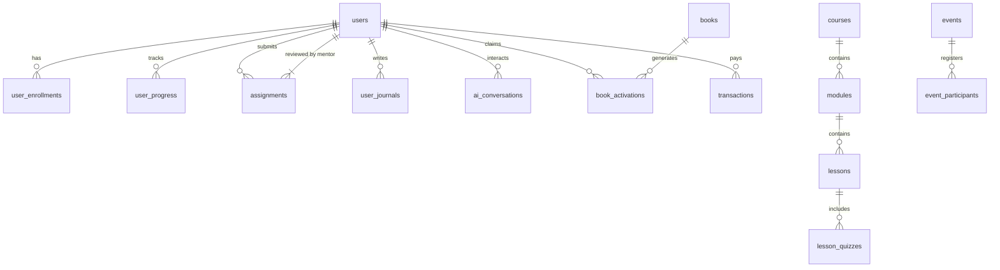

# 👨‍👩‍👧‍👦 Akademi Parenting Bu Elly Risman
> **Platform Edukasi Parenting Hybrid & Asisten AI Berbasis Pengetahuan Bu Elly Risman (Yayasan Kita dan Buah Hati)**

[](https://laravel.com)
[](https://livewire.laravel.com)
[](https://filamentphp.com)
[](https://www.postgresql.org)
[](https://github.com/pgvector/pgvector)
[](https://tailwindcss.com)
[](https://openai.com)

---

## 📌 Ringkasan Eksekutif

**Akademi Parenting Bu Elly Risman** adalah platform edukasi parenting terintegrasi yang menggabungkan buku fisik, pembelajaran video interaktif (metode 2-Layer Video), pengasuhan berlandaskan nilai-nilai psikologi pengasuhan Bu Elly Risman, serta kecerdasan buatan (**AI RAG System**) untuk mendampingi orang tua di seluruh Indonesia dalam mengasuh anak secara bijak dan berbasis sains/psikologi Islam.

Platform ini mengusung metode **Reverse Funnel Distribution**, yang diawali dari penyebaran **6.000 buku fisik** ("Panduan Pengasuhan Anak di Era Digital") untuk diaktivasi menjadi akses platform digital full-featured.

---

## 🚀 Fitur-Fitur Utama

### 1. 📖 Reverse Funnel & Aktivasi Kode Buku Fisik
- Claim & aktivasi buku fisik via QR Code unik 16-karakter.
- Akses otomatis ke program e-learning berjenjang & komunitatif.
- Melacak statistik klaim dan efektivitas jangkauan daerah buku secara real-time.

### 2. 🎥 Pembelajaran 2-Layer Video & Task-Based Learning
- **Layer 1 (Video Utama)**: Materi teori & konsep psikologi parenting dari Bu Elly Risman.
- **Layer 2 (Video Validasi Empatik)**: Cuplikan refleksi & respon emosional saat peserta menyelesaikan kuis/tugas.
- Jurnal Pengasuhan & Refleksi Harian dengan verifikasi tugas oleh Mentor.

### 3. 🤖 AI RAG Knowledge Assistant (Gaya Komunikasi Bu Elly Risman)
- Berbasis **OpenAI GPT-4o + Vector Store (pgvector)** dari transkrip ceramah, buku, dan artikel Bu Elly Risman.
- Respon empati, tenang, ilmiah, dan solutif tanpa menggantikan peran psikolog profesional.

### 4. 🛑 Parental Burnout Detection & Early Warning System
- Analisis multi-signal (sentimen jurnal pengasuhan, pencapaian kuis, keterlambatan tugas).
- Sistem triage otomatis:
  - 🟢 **Rendah**: Rekomendasi konten/artikel penguatan.
  - 🟡 **Sedang**: Notifikasi ke Mentor untuk pendampingan grup.
  - 🔴 **Tinggi**: Alert khusus untuk rujukan konsultasi dengan psikolog Yayasan.

### 5. 🎟️ Event Management & Live Zoom Integration
- Pendaftaran & integrasi tiket otomatis untuk Webinar, Workshop, dan Bootcamp.
- Link Zoom unik per registran dengan sinkronisasi presensi otomatis.

### 6. 📊 Mentor & Admin Dashboard (Filament PHP)
- Panel peninjauan tugas peserta dengan bantuan AI Draft Feedback.
- Manajemen pengguna, konten, e-book, kuesioner, dan laporan finansial/aktivasi.

---

## 🛠️ Arsitektur & Tech Stack

| Layer | Teknologi Utama | Deskripsi |
| :--- | :--- | :--- |
| **Frontend UI** | Livewire 3, Alpine.js, Tailwind CSS | SPA-like feel tanpa overhead JS framework berat |
| **Backend Core** | Laravel 11.x (PHP 8.2+) | Business logic, authentication (Sanctum), RBAC (Spatie) |
| **Admin & Mentor Panel**| Filament PHP 3.x | Back-office management, review assignment, CMS |
| **Database Utama** | PostgreSQL 15+ dengan ekstensi `pgvector` | RDBMS + Vector Similarity Search (Embedding RAG) |
| **Caching & Queue** | Redis | Job queue, session management, vector cache |
| **Streaming Video** | Bunny.net Stream CDN | Security token signed URL, HLS adaptive stream |
| **AI Integrasi** | OpenAI API (Embedding `text-embedding-3-small`, Chat `gpt-4o`) | RAG System |
| **Payment Gateway** | Xendit API (QRIS, VA, E-Wallet) | Gateway pembayaran otomatis event & program premium |
| **Email & Notifikasi** | Brevo (formerly Sendinblue) / Mailgun | Transactional email & WhatsApp API gateway |
| **Infrastruktur** | DigitalOcean VPS + Cloudflare CDN/SSL | Hosting & Security Layer |

---

## 🗄️ Skema Database (18 Entitas Utama)



List Tabel Core:
`users`, `roles`, `courses`, `modules`, `lessons`, `lesson_quizzes`, `user_enrollments`, `user_progress`, `assignments`, `user_journals`, `knowledge_base` *(pgvector)*, `ai_conversations`, `transactions`, `events`, `event_participants`, `books`, `book_activations`, `book_distributions`.

---

## 💻 Panduan Instalasi & Pengembangan Lokal

### Prerequisites
- **PHP** >= 8.2 (dengan ekstensi `pdo_pgsql`, `bcmath`, `mbstring`, `curl`, `redis`)
- **Composer** >= 2.6
- **Node.js** >= 18.x & **NPM**
- **PostgreSQL** >= 15 dengan ekstensi `pgvector` terinstal
- **Redis Server**

### Langkah-Langkah Setup

1. **Clone Repository**
   ```bash
   git clone https://github.com/zuhrisaifudin/ellyrisman.git
   cd ellyrisman
   ```

2. **Install Depedensi PHP & Node.js**
   ```bash
   composer install
   npm install
   ```

3. **Konfigurasi Environment (`.env`)**
   ```bash
   cp .env.example .env
   php artisan key:generate
   ```
   *Sesuaikan kredensial Database PostgreSQL, Redis, dan API Keys (OpenAI, Xendit, Brevo, Bunny.net) pada file `.env`.*

4. **Eksekusi Migrasi & Seeder Database**
   ```bash
   # Pastikan pgvector extension aktif di PostgreSQL
   php artisan migrate --seed
   ```

5. **Jalankan Worker Queue & Storage Link**
   ```bash
   php artisan storage:link
   php artisan queue:work
   ```

6. **Jalankan Server Development**
   ```bash
   npm run dev
   php artisan serve
   ```
   Akses aplikasi di browser pada: `http://localhost:8000`

---

## 📁 Struktur Direktori Project

```text
akademiparenting/
├── app/
├── PRD_AkademiParenting.md    # Product Requirement Document Lengkap
├── README.md                  # Dokumentasi Repository
└── ... (Standard Laravel 11 Structure)
```

---

## 🛣️ Roadmap Pengembangan

- [x] **Fase 1: PRD & Perancangan Arsitektur** (Selesai)
- [ ] **Fase 2: Core Platform & Reverse Funnel Buku** (Dalam Pengembangan)
  - Modul aktivasi buku fisik (QR Code)
  - Pembelajaran 2-Layer Video Engine
  - Admin & Mentor Panel (Filament)
- [ ] **Fase 3: Integrasi AI RAG & Burnout Triage**
  - Embedding materi & setup pgvector
  - Chatbot RAG Bu Elly Risman
  - Engine deteksi burnout otomatis
- [ ] **Fase 4: Event Engine & Integrasi Payment**
  - Xendit QRIS payment gateway
  - Zoom Auto-Sync & Webinar ticketing
- [ ] **Fase 5: Testing, Security Hardening & Launching**

---

## 📄 Lisensi & Hak Cipta

Dokumentasi dan sistem ini dikembangkan untuk **Yayasan Kita dan Buah Hati** & **Bu Elly Risman**.
Seluruh materi edukasi, konten video, dan dataset RAG merupakan hak cipta yang dilindungi undang-undang.

Copyright © 2026 **Yayasan Kita dan Buah Hati**. All rights reserved.
